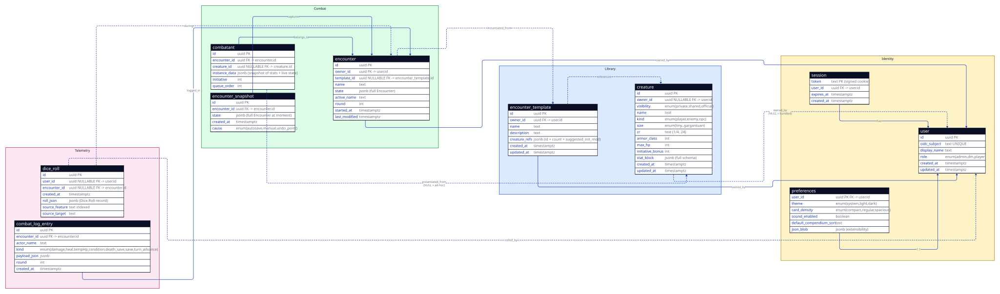

#+title:     Architecture
#+author:    ezpz-dndz
#+language:  en

For developers (and AI agents) joining the project.  Explains how the codebase
is organized and the conventions you're expected to follow.

For the big picture diagram see  (rendered from
[[file:diagrams/data-model.d2]]).

Companion docs:

- [[file:AUTH_TESTING.org]] — local-dev guide for poking at user accounts (browser
  walkthrough + curl recipes), including the rate-limit and per-user-isolation
  smoke tests.
- [[file:DEPLOY.org]] — step-by-step Linux VPS deployment: service account, OIDC
  secret via ~LoadCredential~, systemd units (server + backup timer), Caddy
  reverse proxy with auto- TLS, first-user onboarding, and the per-user
  compendium claim flow.  Backup script lives at ~scripts/backup.sh~; ready-to-
  ~sed~ systemd + Caddy templates under ~deploy/{systemd,caddy}/~.
- [[file:systemd.org]] — LoadCredential + secret-passing notes for the NixOS module.
- ~llms.org~ at the workspace root — LLM-facing coding-rule reference, synced
  from foundation; the no-=unwrap=/=expect= treatise lives there in full.

Historical planning docs (modularization phases 1–11, the rust-template
forward-port plan, the per-tooltip review companion) are no longer kept in-tree;
the load-bearing decisions they captured are folded into this document.

* Stack

- *Backend* — Rust workspace with three crates: a CLI (~ezpz-dndz-cli~), a
  server (~ezpz-dndz-server~, [[https://docs.rs/axum][axum]] + ~aide~ for OpenAPI), and a shared lib
  (~ezpz-dndz-lib~) holding the ~Creature~ schema, the relational ~Db~ core, the
  ~User~ + ~UserStore~ types, and logging-type re-exports.  All three crates
  consume *rust-template-foundation* (a git dep + Nix flake input) for the
  cross-cutting plumbing — config / logging / health / metrics / OIDC
  scaffolding / session machinery / the ~Server~ runner — so this repo only owns
  the application code.
- *Storage* — a relational database via [[https://docs.rs/sqlx][sqlx]]'s ~Any~ driver: SQLite by default
  (~sqlite://<data_dir>/ezpz-dndz.db~, zero-ops dev and small deploys) and
  PostgreSQL via ~--database-url postgres://…~ for hosted scale.  One embedded
  migration set serves both backends; no JSON / JSONB columns anywhere.  See
  [[*Persistence][Persistence]].
- *Frontend* — Elm 0.19 SPA, embedded into the server binary via ~rust_embed~
  (see [[*Frontend serving][Frontend serving]]).  Release builds are a single self-contained binary;
  debug builds read the same assets from disk.  The server falls back to
  ~index.html~ for any unknown path so client-side routing keeps working.
- *Build* — ~cargo~ for Rust, ~elm make~ for Elm.  Both run inside a Nix dev
  shell defined by ~flake.nix~ (which itself delegates to
  ~foundation.lib.mkRustPackages~ and friends).  ~just dev~ and ~just serve~
  auto-enter the dev shell if needed.  The dev shell also carries
  ~pkgs.poppler-utils~ (~pdftotext~ / ~pdftoppm~) for SRD-audit workflows that
  extract the WotC PDF to text.

* Source layout

** Backend

Under =crates/=:

- =cli/= — ~ezpz-dndz-cli~ binary.  Body is a ~#[foundation_main]~- wrapped
  one-liner; configuration is a single ~MergeConfig~ derive that generates
  ~CliRaw~, ~ConfigFileRaw~, and the ~Config::from_cli_and_file~ merge.  The
  ~clap~ subcommand structure rides through ~MergeConfig~'s ~subcommand~ field
  kind.  Subcommands today: ~compendium {list,count,show,import,harvest,
  infer-habitats}~, ~encounter {show,count}~, ~dice {count,tail,clear}~, ~users
  {reset-password}~ (operator-only — writes a fresh Argon2id hash straight into
  the database, no server required).  Data subcommands operate on the database
  through the shared plumbing in =cli/src/db.rs= (per-user scoping via
  ~--email~); the bundle-authoring pair (~harvest~ / ~infer-habitats~) stays
  file-based on purpose — it authors bundle content, not runtime state.  See
  [[*Backend: a new CLI subcommand][Backend: a new CLI subcommand]].
- =server/src/=
  - ~main.rs~ — ~#[foundation_main]~ entry point.  Connects the ~Db~ (which runs
    the embedded migrations), assembles ~AppState~ (which runs the one-shot
    legacy-JSON import and the compendium split migration), hands it to
    ~Server::with_state~, layers ~require_auth~ over the ~/api/*~ subtree,
    merges the auth + dice + compendium + encounter + per-user-preset
    sub-routers, and installs the embedded frontend via ~.spa::<Frontend>()~.
  - ~lib.rs~ / ~web_base.rs~ — module index + the slimmed ~AppState~ (the shared
    ~Db~ handle plus the app stores built over it; foundation's
    ~BaseServerState~ rides through ~impl_server_state!(AppState, base)~).
  - ~config.rs~ — ~MergeConfig~-derived ~Config~ with skip-field resolvers
    (~paths~ / ~database_url~ / ~oidc~ / ~compendium_claim_user~) handling
    cross-field rules MergeConfig can't model directly.  ~database_url~ defaults
    to the SQLite file inside ~--data-dir~; ~RuntimePaths::from_data_dir~
    derives the *legacy* JSON-file locations from the same directory — those
    files are one-shot import inputs kept as rollback copies, not live stores.
  - ~frontend.rs~ — the ~rust_embed~-derived ~Frontend~ type holding the
    compiled Elm assets.  See [[*Frontend serving][Frontend serving]].
  - ~users/~ — *real surface*, not a stub: ~/api/auth/{register,
    login,logout,me}~ handlers, ~require_auth~ middleware, ~CurrentUser~
    extension wrapper, ~AuthHttpError~ → status code mapper.
  - ~dice.rs~ — ~/api/dice/*~ (per-user history, normalized into the
    ~dice_rolls~ table family; the serde types mirror the Elm encoder in
    =frontend/src/Dice.elm= field for field).
  - ~compendium/~ — ~/api/compendium/*~ over the migration-0003 tables: per-user
    creatures (~user_store.rs~ + the ~creature_rows~ codec), named snapshots
    (~saves.rs~ + the ~save_body~ node-tree codec), and groups (~groups.rs~).
    ~bundled.rs~ holds the embedded SRD set; ~store.rs~ + ~json_file_store.rs~
    are quarantined legacy machinery that only feed the one-shot split migration
    (~migrate.rs~).
  - ~encounters/~ — ~/api/encounter~ (per-user live encounter, fully typed
    through ~wire.rs~ + ~rows.rs~ into the migration-0004 tables) +
    ~/api/encounter/saves/*~ (~saves.rs~, typed metadata over opaque node-tree
    bodies in ~save_nodes.rs~) with conflict / not-found / name-validation
    semantic errors.
  - ~per_user_store.rs~ — the generic per-user preset router: a ~PerUserFeature~
    trait (wire codec + the SQL mapping a decoded payload onto the feature's
    tables, implemented by the five stateless codecs in ~presets/~), a shared
    error type that carries the feature label so messages stay semantic, and a
    ~routers()~ function registering the authenticated GET/PUT pair for all five
    features — lore groups, condition presets, Save Chain presets, treasure
    table, treasure profiles.
  - ~presets/~ — the five ~PerUserFeature~ codecs (one module per feature), each
    mirroring its Elm ~*.Wire~ module including legacy-shape leniency.
  - ~json_import.rs~ — the one-shot boot import of the legacy JSON stores.  See
    [[*Persistence][Persistence]].
- =lib/src/=
  - ~db.rs~ — the ~Db~ handle (a cloneable sqlx ~AnyPool~): installs the runtime
    drivers, normalizes SQLite URLs (parent-dir creation, create-if-missing,
    single-connection pool so one writer sidesteps ~SQLITE_BUSY~), and runs the
    embedded migrations from =crates/lib/migrations/= on connect — sqlx 0.8
    implements ~Migrate~ for ~AnyConnection~, so one migration set serves both
    backends.
  - ~compendium/~ — ~Creature~ schema, parser, Open5e import, bundled-creatures
    (=data/bundled-creatures.json= via ~include_str!~), plus ~group.rs~ (~Group~
    / ~GroupDraft~ / ~GroupEntry~ / ~InitiativeMode~ / ~MinionType~) for the
    compendium-groups feature.
  - ~users/~ — ~User~ / ~UserId~ / ~UserPublic~ types, ~UserStore~ (SQL-backed
    over ~Db~; Argon2id hashing, email-uniqueness check, validation rules).
  - ~logging.rs~ — re-exports of foundation's ~LogLevel~ / ~LogFormat~ so
    existing =use ezpz_dndz_lib::{LogLevel, LogFormat};= imports keep resolving.
  - ~cr_calc/~ — challenge-rating estimator used by the paste- block path.

Foundation owns everything that used to live in =server/src/= as ~auth.rs~ /
~systemd.rs~ / ~logging.rs~: OIDC handlers, systemd notify / watchdog,
structured-logging init.  The Phase-4 forward-port deleted those files from this
repo; their behaviour is intact, just imported.

** Frontend serving

The compiled Elm frontend is embedded into the server binary rather than served
from an on-disk directory (there is no ~--frontend-path~ flag).  The pieces:

- =crates/server/build.rs= resolves the asset directory: it honors
  ~RUST_TEMPLATE_FRONTEND_DIR~ when set (the Nix build passes the freshly
  compiled Elm derivation) and defaults to the in-tree =../../frontend/public=
  for a plain ~cargo build~ / ~cargo run~.
- =crates/server/src/frontend.rs= declares the ~rust_embed~-derived ~Frontend~
  type over that directory.  Release builds bake the assets into the binary, so
  the deployed server is fully self-contained; debug builds read them from disk,
  so fresh ~elm make~ output is picked up without recompiling the server.
- =main.rs= installs the assets as the SPA fallback via foundation's
  ~.spa::<Frontend>()~ — anything the API routers don't claim resolves against
  the compiled assets, with ~index.html~ covering client-side routes.
- =nix/packages/server.nix= builds the Elm bundle as its own derivation and
  hands it to the crate build through ~RUST_TEMPLATE_FRONTEND_DIR~, replacing
  the old layout that shipped a sibling =share/frontend= asset directory next to
  the binary.

** Frontend

Under =frontend/src/=, organized by responsibility.  The single- file ~Main.elm~
is now a pure application shell (~2.8k lines, almost all dispatch-table
boilerplate) — every modal, view, update branch, per-feature UI substate, page
tree, and Cmd helper lives in its own module.

| Region          | Modules                                                                                                                                 |
|-----------------+-----------------------------------------------------------------------------------------------------------------------------------------|
| Application     | =Main.elm= (boot + dispatch table), =Model.elm= (record + Modal ADT), =Msg.elm=                                                          |
| Auth            | =Auth.elm= (~AuthState~ ADT + ~User~ + decoder)                                                                                          |
| Domain          | =Encounter.elm= + =Encounter/{DeathSaves,Difficulty,Lifecycle,RandomEncounter,Roster,SaveChain,SaveNotice,Seed,Treasure,Wire,Xp}= (plus the =RandomEncounter/Lore=, =SaveChain/{Bundled,Export,Wire}=, and =Treasure/*= sub-modules) |
| Domain          | =Compendium.elm= + =Compendium/{Group,GroupWire,Parser,Reference,SpellcastingText,Wire}= |
| Domain          | =Dice.elm=, =HpChange.elm=, =Preferences.elm=                                                                                            |
| Routing / Cmd   | =Route.elm= (~Home / Login / Me / Donate / About / CompendiumCreaturePage / Compendium / QuickList / NotFound~), =Effects.elm= (every Cmd-emitting helper, HTTP included, plus the ~shouldPersistAfter~ / ~shouldBroadcastAfter~ persistence predicates), =Ports.elm= (outbound JS — ~savePreferences~, the ten ~persistLocal*~ ports, the three ~clearLocal*~ sign-in-migration ports, clipboard, and the cross-tab BroadcastChannel ports) |
| UI substate     | =Ui/{AbilitySave,Account,Compendium,Condition,CrCalculator,Dice,Duplicate,GroupEdit,HpChange,Initiative,LoadCompendium,Login,LoreEdit,Memo,ModalChrome,Note,PlaceholderRename,QuickAdd,RandomEncounter,SaveChain,SaveCompendium,SaveLoad,Timer,Toast,Treasure,TreasureTable}.elm= |
| Update / shell  | =Update/Shell.elm= (URL routing, ~/me~, encounter persist response, settings popover, ~NoOp~), =Update/Tabs.elm= (cross-tab BroadcastChannel receive paths — ~encounterFromOtherTab~, ~panelShowFromOtherTab~, ~incomingPanelShow~) |
| Update / auth   | =Update/Auth.elm= (boot probe, login / register submit + response, logout, form-field changes), =Update/UserSync.elm= (boot + one-shot-migration responses for the per-user server stores) |
| Update / domain | =Update/*.elm= — one module per feature, each exposing one function per Msg branch |
| Update / split  | =Update/Compendium/{Add,AddGroup,Browser,Bulk,Edit,Group,Lore,Paste}.elm=                                                               |
| View / surfaces | =View/Modal/*.elm= for what still opens over the page and =View/Panel/*.elm= for what opens in the Actions column's drawer; =View/Modal.elm= and =View/Panel.elm= carry the two shells, whose shared fields line up |
| View / pages    | =View/Page/{Loading,Donate,NotFound,Compendium,CompendiumStandalone,QuickList}.elm= — the page trees ~Main.viewPage~ dispatches to (formerly inline in =Main.elm=) |
| View / shell    | =View/*.elm= — the chrome around the surfaces, and the renderers they share.  =View/AuthGate.elm= holds the ~clickWhenAuthed~ / ~tooltipWhenAuthed~ helpers for sign-in-nudging server-only controls. |
| Util            | =Util/{Http,Keyboard,Number}.elm=                                                                                                       |

Tests live under =frontend/tests/= as a flat ~Test~ suite per domain module:
=DiceTest=, =EncounterTest=, =HpChangeTest=, =CompendiumParserTest=,
=CompendiumTest=, =SaveChainTest=, =SaveChainExportTest=, plus
=Encounter/{DeathSavesTest,LifecycleTest,LoreSuggestTest,RandomEncounterTest,RosterTest,TreasureFairnessTest,TreasureSettingsTest,TreasureToggleTest,WireTest,XpTest}=,
=Compendium/WireTest=, =Ui/Condition/BundledTest=, and =Util/NumberTest=.

* Layering: domain vs view

*The rule:* D&D rules logic lives in domain modules (=Encounter/*=, =Dice=,
=HpChange=, =Compendium/*=).  UI code (=View/*=, =Update/*=) imports them and
uses their types and functions.  Logic code never imports view code.

The reason it matters: we ship multiple UI layouts (a "simple view" stripped of
advanced controls, possibly a tablet layout).  Each layout still operates on the
same encounter state and the same turn rules.  If rules code starts importing
~Html~, swapping layouts means rewriting rules — not acceptable.

In practice:

- Domain modules don't ~import Html~, ~Browser~, ~Url~, or any rendering
  primitive.  The compiler enforces.
- A ~Msg~ branch in =Main=' s =updateInner= should be a one-liner that delegates
  to ~Update.Foo.bar~.  If the branch starts walking the queue, comparing
  initiative, or doing HP arithmetic, the work belongs in =Encounter= or
  =HpChange=.
- Cmd-emitting work goes through =Effects.elm= rather than being built inline in
  update branches.  Update modules never ~import Http~ directly — the compendium
  CRUD requests, for example, live in Effects as ~postCompendiumCreature~ /
  ~putCompendiumCreature~ / ~deleteCompendiumCreature~ /
  ~importCompendiumBundle~ / ~clearCompendiumCreatures~ / ~resetCompendium~.

* Model and modal state

=Model.elm= defines the single source of truth.  The interesting piece is the
~Modal~ ADT:

#+begin_src elm
type Modal
    = ModalHpChange HpChangeUi
    | ModalInitiative InitiativeUi
    | ModalNoteEdit NoteEditUi
    | ModalCondition ConditionUi
    | ModalMemoEdit MemoEditUi
    | ModalTimerSetup TimerSetupUi
    | ModalCompendiumEdit CompendiumEditUi
    | ModalCompendiumPaste CompendiumPasteUi
    | ModalSave SaveUi
    | ModalLoad LoadUi
    | ModalSaveCompendium SaveCompendiumUi
    | ModalLoadCompendium LoadCompendiumUi
    | ModalAbilitySave AbilitySaveUi
    | ModalQuickAdd QuickAddUi
    | ModalDuplicate DuplicateUi
    | ModalGroupEdit GroupEditUi
    | ModalLoreEdit LoreEditUi
    | ModalCrCalculator CrCalculatorUi
    | ModalRandomEncounter RandomEncounterUi
    | ModalTreasure TreasureUi
    | ModalTreasureTable TreasureTableUi
    | ModalSpellList
    | ModalSaveChain SaveChainUi
#+end_src

~Model.modal : Maybe Modal~ replaces a stack of ~Maybe XxxUi~ fields.  The "only
one modal open at a time" invariant is now type-enforced rather than convention.

In addition, the model carries small non-modal pieces of UI state that are
scoped to the workspace shell rather than to a single feature:

- ~savedSnapshot : Maybe Encounter~ + ~savedAs : Maybe String~ — the most recent
  persisted state of the encounter and the name it was saved under.  Set by Save
  / Load success and consumed by the Save button's dirty indicator, which lights
  when the live roster differs from the snapshot.
- ~panelCreaturePin : Maybe { id, name }~ — the drawer's pinned creature.
  Carries both the compendium id (canonical UUID lookup) and the encounter
  creature's display name (so a name fallback covers older saved encounters
  whose ~creatureId~ no longer matches anything in the bundled compendium).
- ~xpScope : XpScope~ — which creatures the XP total counts.  Both the readout
  and the scope live in the Actions column; the picker's open state is the
  ~SurfaceXp~ marker in the drawer stack, not a field.
- ~settingsOpen : Bool~ — AppBar settings popover (theme picker today; density /
  sound when those land).  A controlled ~
~ rather than a native
  ~
/
~, so global Esc + click-outside subscriptions in
  =Main.subscriptions= can close it.
- Compendium-modal popovers (Clear / Import / Export) live on the compendium UI
  substate as ~bulkMenu : Maybe CompendiumBulkMenu~.
- ~preferences : Preferences~ — see [[*Preferences][Preferences]] below.
- ~auth : Auth.AuthState~ + ~loginUi : Ui.Login.LoginUi~ — authentication status
  (Loading / Anonymous / Authenticated) and the login / register form's typing
  state.  See [[*Authentication and per-user storage][Authentication and per-user storage]] for the boot flow.

Two surfaces — the dice roller and the compendium browser — keep their substate
*outside* the ADT because it has to survive a close (dice history, compendium
cache + filter).  They live as =Model.dice : DiceUi= / =Model.compendium :
CompendiumUi=; the roller's openness is the ~SurfaceDice~ marker's presence in
the drawer stack, while the browser renders as the standalone =/compendium= tab
and so has no open state at all.

The compendium UI substate also carries ~savedAs : Maybe String~
+ ~compendiumDirty : Bool~ — last saved-snapshot name, and "library has unsaved
  changes" flag that lights the Export trigger yellow.  Both clear on a
  successful Save / Load / Import; Clear All / Clear Selected keep dirty=True
  since the GM just discarded creatures and probably wants to commit a fresh
  snapshot.

Per-feature update modules use a small ~with*~ lens that goes through the
generic ~Model.mapModal~ helper plus a per-variant ~Model.fooLens~ value.  Each
lens definition is a one-liner; the five-line pattern-match boilerplate lives in
=Model.elm= once.

#+begin_src elm
withHpChange : (HpChangeUi -> HpChangeUi) -> Model -> Model
withHpChange =
    Model.mapModal Model.hpChangeLens
#+end_src

~Model.mapModal~ takes a ~ModalLens a~ record (the ~extract~ / ~wrap~ pair for
one Modal variant), an update function ~a -> a~, and the Model.  It is a no-op
if ~model.modal~ is ~Nothing~ or holds a different variant — the same semantics
the per-module ~with*~ helpers had before, with one shared implementation.

* Turn lifecycle

5e initiative is a single linear queue: each creature acts in turn, and after
the lowest-initiative creature acts the round ends and we loop back to the
highest.  The app models this with three fields on =Encounter=:

- ~creatures : List Creature~ — the queue, in initiative order.
- ~activeName : String~ — whose turn it currently is.
- ~round : Int~ — 1-indexed round counter.

An empty ~activeName~ is the pre-combat sentinel: the queue is set up but no one
has acted yet.  Reset / Clear / Load all return the live encounter to round 1
with nobody active.  In that state the Actions column's Turn button dispatches
~EncounterRun~, which calls ~Encounter.run~ — it sets the active creature to the
queue head (highest initiative).  Once someone is active the same button
dispatches ~NextTurn~ instead.

Turns advance through =Encounter.Lifecycle.nextTurn=, invoked by
~Update.Encounter.nextTurn~ when the user presses the Turn button.  The
lifecycle module owns:

1. *Dead-skip rule* — creatures with three failed death saves
   (~Encounter.isDeathSaveDead~) are skipped permanently.  The iteration cap
   (queue length) covers all-dead TPK.
2. *Condition lifecycle hooks* — bracketing the queue walk: ~applyEndOfTurn
   outgoing → skipUnplayable → applyBeginOfTurn incoming~.  The end-of-turn pass
   ticks the outgoing creature's ~DurationCountdown AtEnd~ conditions and
   expires every ~DurationUntilTurn AtEnd <name>~ across the encounter; the
   begin-of-turn pass does the same for the ~AtBegin~ phase.

The 5e Surprised state was reintroduced in 2026-06 as a per- creature ~surprised
: Bool~ flag.  The initiative editor's Surprised toggle flips the flag on
whichever creatures are in scope before the roll / apply runs.  Card row 1 and
the encounter title-bar active-creature summary both render a 😲 badge to the
left of the name while surprised.  The end-of-turn lifecycle hook
(~applyEndOfTurn~) clears the flag for the outgoing creature, so Surprised burns
off after the surprised creature finishes their first turn — matching the rule.
Surprised creatures are suppressed from the LA-availability reminder strip but
not the Special Reactions strip (the rule only bars LA use, not ordinary
reactions).

** Creature record extensions

~Encounter.Creature~ gained several fields beyond the original combat core to
support placeholder stubs, stat-block-style metadata, and the reintroduced
Surprised + Special-Reactions hints:

- ~isPlaceholder : Bool~ — flags stubs spawned via
  ~Encounter.Roster.appendPlaceholder~.  Preserved across ~renameCreature~ so
  the click-to-rename affordance survives the rename round-trip.
- ~creatureKind : String~ — ~"player"~ / ~"enemy"~ / ~"npc"~ (lower- case wire
  token); drives the title-row kind badge in =View.StatBlock= and roster
  filters.
- ~race : String~ — free-form (e.g. ~"Dragon"~), rendered in the stat-block meta
  strip.
- ~alignment : String~ — free-form (e.g. ~"lawful evil"~), same.
- ~surprised : Bool~ — set by the initiative editor's Surprised toggle riding
  along with whichever roll or apply the GM clicks, and cleared by
  ~applyEndOfTurn~ after the creature's first turn.  Drives a 😲 badge on the
  card + title bar and suppresses the creature from the LA-availability strip.
- ~hasSpecialReactions : Bool~ — copied from the compendium template at spawn
  time.  When set, the card's reaction pip drops the lightning glyph for a
  pulsing bright-blue ~!~ and the creature shows up in the "Special reactions:
  …" sticky strip beneath the title bar.  Toggleable per-creature via a checkbox
  in the compendium editor; auto-set on 22 bundled SRD creatures (Hydra,
  Marilith, Vampire, mephits, …).
- ~specialReactionsUsed : Set String~ — names of the reactions the GM has struck
  through on the card's badges.  Cleared at the bearer's begin-of-turn, the way
  the single reaction pip is.

=Encounter.Wire= encodes them all; the decoder uses ~optional~ with safe
defaults (~False~ / ~""~) so legacy persisted encounters and saved snapshots
round-trip cleanly.

The auto-roll save path lives in =Update/Encounter.elm=: when ~nextTurn~ fires,
the outgoing name is captured before the lifecycle hooks run, then
~Effects.autoRollCmdsFor AutoRollAtEnd outgoing newEnc~ + ~AutoRollAtBegin
newName newEnc~ are batched.  Results land in ~ConditionSaveLanded~, which
removes the condition on ~roll.total >= dc~ and posts a green "Saved:
<Condition>" notice when ~wasAutoRoll = True~.

The pure domain layer doesn't fire Cmds; that's the right boundary.

A separate "manual scrub" path: clicking the → arrow on any creature card
immediately makes that creature active without advancing the turn
(~Update.Encounter.setActive~).  By design, ~setActive~ does *not* increment
~round~ or fire turn-progression hooks — neither would-be end-of-turn for the
previous active creature nor would-be beginning-of-turn for the new one.

* Update dispatch

~Main.updateInner~ is a flat dispatch table where every Msg branch is a
one-liner that calls into a per-feature =Update/Foo.elm= module.  Each Update
module owns:

- ~with*~ lens(es) into the relevant Model fragment (private, defined as a
  one-liner over ~Model.mapModal~ + the matching ~Model.fooLens~ value).
- The ~open~, ~close~, ~apply~, etc. functions that handle the feature's Msg
  branches.
- Any feature-specific helpers that don't belong in the domain layer (e.g.
  dice-source labels, HP-change preview math).

Cmd-emitting helpers shared across features (dice roll persistence, /me fetch,
scroll-into-view, condition auto-roll batching) live in =Effects.elm=.

When a feature's Update module crosses ~600 LOC the next pass splits it into
per-section sub-modules under =Update/<Feature>/=, each owning one cohesive area
of the feature's Msg surface.  =Update/Compendium/= is the canonical example:
=Browser.elm= (modal lifecycle), =Add.elm= (queue materialization), =Edit.elm=
(form fields + submit / delete), =Paste.elm= (parsed-block hand-off), =Bulk.elm=
(import / reset / confirm-banner flow).

=Update/Shell.elm= is the home for application-shell branches that don't fit a
domain feature — URL routing (~urlRequested~ / ~urlChanged~), the ~/me~ identity
badge (~gotMe~), encounter persist response (~encounterLoaded~ /
~encounterPersisted~), the AppBar settings popover (~settingsToggle~ /
~settingsClose~), and ~NoOp~.  Anything that's pure UI plumbing at the boundary
between the Elm runtime and the workspace shell goes here rather than inflating
=Main.elm=.

=Update/Tabs.elm= is its sibling for the cross-tab BroadcastChannel receive
paths: ~encounterFromOtherTab~ (adopt an encounter another tab broadcast),
~panelShowFromOtherTab~ (decode a pin-this-creature message), and
~incomingPanelShow~ (apply it).  The outbound side stays in the =Main.update=
wrapper, guarded by ~Effects.shouldBroadcastAfter~ so a received broadcast is
never re-broadcast.

* View dispatch

~Main.view~ branches on ~model.auth~ before getting to the app shell.  The three
branches:

#+begin_src elm
case model.auth of
    Auth.AuthLoading ->
        [ View.Page.Loading.view ]

    Auth.AuthAnonymous ->
        appShell Nothing model

    Auth.AuthAuthenticated user ->
        appShell (Just user) model
#+end_src

~viewPage~ itself is a pure route dispatcher: every page tree lives in a
=View/Page/*= module (Loading, Donate, NotFound, Compendium,
CompendiumStandalone, QuickList) and =Main.elm= only picks which one to call.

Both ~AuthAnonymous~ and ~AuthAuthenticated~ render the same shell (AppBar +
~viewPage~ + every modal + toast / audio / footer).  The single difference is
the ~Maybe Auth.User~ argument threaded into ~View.AppBar.view~: ~Just user~
shows the display- name link, ~Nothing~ shows a "Sign in" link to ~/login~ (or
nothing at all when already on ~/login~ — see [[*Anonymous mode][Anonymous mode]]).

The login form itself is no longer a full-body replacement.  It lives behind a
new ~Route.Login~ as a normal page-route rendered by ~viewPage~, so anonymous
users can browse the encounter manager, edit creatures, roll dice, etc., without
ever signing in.  See [[*Anonymous mode][Anonymous mode]] for the localStorage persistence layer that
makes that work.

Modal views pattern-match on ~model.modal~ for the matching constructor and
render ~text ""~ otherwise.  The =View.Modal.view= helper provides shared chrome
(backdrop, header, ✕ close, click-out-to-close, Esc-to-close) — every modal in
the app routes through it.  The chrome also installs a focus sentinel after the
body content and a Stop-hook–style focus redirect in =app.js=, so keyboard / SR
users land on the close button when a modal opens and Tab wraps within the modal
instead of escaping to the underlying page.

** Modal drag + edge-resize

=View.Modal.view= takes a ~chrome : ModalChrome~ argument (=Ui/ModalChrome.elm=,
pure math: drag / resize state, viewport clamp, size clamp, edges N/S/E/W + 4
corners).  The header carries a drag handle; eight invisible perimeter handles
emit ~mousedown~ decoders that read ~currentTarget.parentElement.offsetWidth /
offsetHeight~ for live size on each gesture.

=Update/ModalChrome.elm= owns the state machine.  =Main.subscriptions= attaches
~Browser.Events.onMouseMove~ / ~onMouseUp~ *only while a gesture is in flight*
so idle modals don't pay the per-frame cost.  Chrome resets to
~Ui.ModalChrome.fresh~ on every modal-open transition; the size clamp uses
CSS-token defaults (~--modal-max-w: 640px~, modal- specific overrides like
~.modal--condition { --modal-max-w: 480px }~).

* Authentication and per-user storage

The server is account-gated: every ~/api/*~ endpoint outside ~/api/auth/*~
requires a session, and every server-side store except the shared compendium
catalogue is keyed by the authenticated user's ~UserId~.

The *frontend* is not account-gated.  Anonymous users get a fully-functional app
— live encounter, named saves, dice roller, compendium with full CRUD — backed
by ~localStorage~ instead of the server.  Signing in auto-migrates the relevant
local data to the user's account.  See [[*Anonymous mode][Anonymous mode]] for the architecture.

** Account model

~User~ records carry a stable UUID id, a case-insensitively- unique email, an
Argon2id PHC password hash, a free-form display name, and a unix-epoch
~created_at~.  Storage is the relational ~users~ table (migration 0001) via
~UserStore~ over the shared ~Db~ handle; the duplicate-email conflict the
register route returns maps straight off the insert.

Email + password is the only auth mechanism today.  The foundation crate also
ships an OIDC flow (login / callback / logout handlers, ~require_auth~
middleware), and we leave it mounted but unconfigured — the ~/auth/*~ routes
return 404 until ~--oidc-issuer~ + friends are set.  The "free, no email
verification, self-service" model lives at ~/api/auth/*~ and is ours.

** HTTP surface

| Endpoint                  | Behaviour                                                                  |
|---------------------------+----------------------------------------------------------------------------|
| ~POST /api/auth/register~ | Create an account; auto-login on success.  201 + the new ~UserPublic~.     |
| ~POST /api/auth/login~    | Verify credentials, cycle the session id (anti-fixation), set ~user_id~ in the session.  200 + ~UserPublic~. |
| ~POST /api/auth/logout~   | Flush the session.  204.  Idempotent.                                      |
| ~GET  /api/auth/me~       | Echo the current user, or 401.                                             |

The credential-error variants (no such email, wrong password) collapse to a
single 401 ~"Invalid email or password"~ response so timing / error-text
differences don't leak account-existence information.

** Session and middleware

Sessions ride on ~tower-sessions~ via foundation's runner (~MemoryStore~ today;
restarting the server logs everyone out).  The session cookie is ~SameSite=Lax~
and ~Secure~ in production builds.  ~user_id~ is the only key the app stores.

~users::require_auth~ is the middleware layered over the protected ApiRouter: it
pulls ~user_id~ off the session, looks up the ~User~ via
~UserStore::find_by_id~, and inserts a ~CurrentUser(User)~ extension on the
request.  Handlers that need the user extract ~Extension<CurrentUser>~ alongside
their other inputs.  No session, no user → 401 with a JSON body.

** Per-user data shapes

Every store is a family of relational tables keyed by ~user_id~ (with ~ON DELETE
CASCADE~ back to ~users~), defined across the four migrations under
=crates/lib/migrations/=:

| Table family                     | Migration | Notes                                                              |
|----------------------------------+-----------+--------------------------------------------------------------------|
| ~users~                          | 0001      | One row per account; uniqueness enforced case-insensitively on email. |
| ~dice_rolls~ (+ ~_expression_dice~ / ~_groups~ / ~_faces~ / ~_extras~ children) | 0001 | Fully normalized roll log; 30-entry cap is per-user.  Unknown top-level scalar fields round-trip via ~dice_roll_extras~. |
| ~lore_group_sets~ → ~lore_groups~ → ~lore_group_members~ | 0002 | One of the five preset families; the ~_sets~ row is the presence parent (see below). |
| ~condition_preset_sets~ → ~condition_presets~ | 0002 | Saved Add-Condition forms.                                        |
| ~save_chain_sets~ → ~save_chains~ → ~save_chain_effects~ | 0002 | Save Chain preset recipes.                                        |
| ~treasure_table_sets~ → brackets / individual rows / hoard rows / name entries / flat items / roll specs | 0002 | The user's singular treasure table. |
| ~treasure_profile_sets~ → ~treasure_profiles~ | 0002 | Named "Tune your rolls" presets.                                  |
| ~user_creatures~ (+ 10 children: saving throws, skills, damage relations, string lists, features, legendary options, custom sections, spell levels, innate groups, spell names) | 0003 | Per-user creature edits + creations + duplicates of bundled.  Every ~Creature~ scalar is a column; the four Option packs (legendary / lair / regional / spellcasting) flatten as all-null-together groups.  See [[*Compendium: bundled vs per-user][Compendium: bundled vs per-user]]. |
| ~compendium_groups~ → ~compendium_group_entries~ | 0003 | Per-user creature groups (a.k.a. Hordes); see [[*Compendium groups (Hordes)][Compendium groups (Hordes)]]. |
| ~compendium_saves~ → ~compendium_save_nodes~ | 0003 | Named compendium snapshots: typed metadata (name + timestamps) over a contractually opaque body stored as a relational JSON node tree — one row per node, numbers kept as their canonical serde token so int/float fidelity survives.  Save-name uniqueness is per-user. |
| ~encounters~ (+ creatures / conditions / save notices / recharge abilities / pips / treasure + its contributions / items) | 0004 | The live encounter, fully typed — treasure settings flatten onto the ~encounters~ row itself; absent row reads as ~null~. |
| ~encounter_saves~ → ~encounter_save_nodes~ | 0004 | Named encounter saves; same metadata-over-node-tree shape as compendium saves.  Alice + Bob can both have a "Goblin Ambush". |

The five preset families share a *presence-parent* pattern: ~GET~ returns ~null~
when the user has never persisted the feature (no ~_sets~ row) and the canonical
re-encoding otherwise — persisted-but-empty included.  The frontend's
=Update.UserSync= boot / migrate branching depends on exactly that tri-state
distinction; ~PUT~ is a transactional swap (cascade-delete the parent, insert
the decoded replacement).

The bundled SRD set is *not* in the database — it is content, not state.  It
lives in the binary via ~include_str!~ and is merged into every read at request
time.  See [[*Compendium: bundled vs per-user][Compendium: bundled vs per-user]] for the full split and migration
story.

** Compendium: bundled vs per-user

The compendium has two layers that the server merges at request time:

- *Bundled creatures* (the SRD 5.2.1 set) live read-only in the binary.
  ~crates/server/src/compendium/bundled.rs~ parses
  =crates/lib/data/bundled-creatures.json= at boot and exposes an O(1)
  ~contains(id)~ check.  Updates only ship via a binary rebuild +
  ~BUNDLED_VERSION~ bump in ~crates/server/src/compendium/store.rs~.
- *Per-user creatures* (custom creations, edits, duplicates) live in
  ~UserCompendiumStore~ over the ~user_creatures~ table family (migration 0003),
  keyed by ~user_id~.

Every ~Creature~ that crosses the wire carries an ~is_bundled : bool~ field that
the server computes from ~BundledCompendium::contains(id)~ on the way out.  The
flag is ~#[serde(default, skip_deserializing)]~ so clients can't forge it on the
way in.

The HTTP surface:

| Endpoint                                    | Behaviour                                                                 |
|---------------------------------------------+---------------------------------------------------------------------------|
| ~GET /api/compendium/creatures~             | Returns bundled rows ++ the caller's per-user rows, with ~is_bundled~ stamped. |
| ~GET /api/compendium/creatures/{id}~        | Tries bundled first, then the caller's per-user store; 404 otherwise.    |
| ~POST /api/compendium/creatures~            | Creates in the caller's per-user store with a fresh UUIDv4.              |
| ~PUT /api/compendium/creatures/{id}~        | 403 ~BundledNotEditable~ if ~id~ is bundled; otherwise updates the caller's record. |
| ~DELETE /api/compendium/creatures/{id}~     | Same scoping — 403 on bundled.                                            |
| ~POST /api/compendium/creatures/{id}/duplicate~ | Clones (bundled or own) into caller's store with a fresh UUIDv4 and "Copy of …" name prefix.  The only path to an editable copy of a bundled creature. |
| ~POST /api/compendium/import~               | Replaces the caller's per-user list (bundled-id rows in the body are silently dropped). |
| ~POST /api/compendium/reset~                | Drops the caller's per-user creatures + groups; bundled reappears via the merge. |
| ~GET /api/compendium/export~                | Returns the caller's per-user creatures + groups only — bundled is omitted because the receiver's server already has it. |

Frontend UI mirrors the model: the compendium browser hides Edit and Delete on
bundled rows, shows Duplicate, and stamps a small "Bundled" chip on the
stat-block header.  See ~frontend/src/View/Modal/Compendium.elm:actionBar~ and
~View.StatBlock.bundledBadge~.

** Anonymous-mode compendium split

The anonymous snapshot in ~localStorage["compendium"]~ stores *only*
user-created creatures.  Bundled rows are always refetched from
~/bundled-creatures.json~ on every boot and merged with the snapshot's user
data.  Why:

- The snapshot stays small (KB instead of MB).
- A bundle update reaches an anonymous browser on the next reload, no DevTools
  surgery required.
- The merge step (~Update.Compendium.Browser.mergedResult~) keeps user-created
  creatures whose ids aren't in the fetched bundle, so authoring locally still
  survives a refresh.

The snapshot carries a ~bundled_version~ stamp; on boot, when the recorded
version is older than ~Compendium.Wire.currentBundledVersion~, the merge fires
automatically.  See ~Update.Auth.applyLocalCompendium~.

** Split migration (pre-split → post-split data dir)

Pre-split deployments had a single shared =<data_dir>/compendium/creatures.json=
that mixed bundled + user-edited + user-created rows.  The one-shot migration at
~crates/server/src/compendium/migrate.rs~ runs on boot when the sidecar marker
=<compendium_dir>/.split-v1= is absent.  It reads the legacy shared file through
the quarantined JSON-file store (=compendium/json_file_store.rs=, the last
surviving copy of the old persistence helper — legacy-import machinery only) and
writes into the relational per-user store; it runs after the boot JSON import so
the claim user's account already exists.  The steps:

1. Walks the legacy store and partitions rows into:
   - *Canonical bundled* (id matches the bundle byte-for-byte) → dropped.
     Bundled rows live in-binary post-split.
   - *Edited bundled* (id in the bundle but content differs) → forked into the
     claim user's store with a fresh UUIDv4 and a "Copy of …" name prefix.  The
     bundled original is restored.
   - *User-created* (id not in the bundle, typically a UUIDv4 from the legacy
     create path) → migrated as-is.  Original ids are preserved so existing
     encounter references keep resolving.
2. Requires ~--compendium-claim-user <email>~ when there's data to claim; the
   server refuses to start without the flag so the operator can make the
   decision deliberately.
3. Writes the marker file recording version, timestamp, claimed user, and
   counts.  Subsequent boots see the marker and skip.

Existing dev-mode legacy JSON of an older flat shape fails to deserialize and
the loader falls back to an empty store (logged at WARN).  Fine for dev; the
one-shot boot import applies the same warn-and-skip discipline per file and per
user (see [[*Persistence][Persistence]]).

** Login-only rate limit

~crates/server/src/auth_rate_limit.rs~ wraps ~/api/auth/login~ and
~/api/auth/register~ with a per-IP fixed- window token bucket: 10 attempts / IP
/ 60 seconds, returning ~429 Too Many Requests~ + ~Retry-After~ once the bucket
overflows.  IPs come from ~X-Forwarded-For~'s first hop (Caddy / nginx set this
in the documented deployment) with a shared fallback bucket for direct
connections.

Session-only endpoints (~logout~, ~me~, ~password~) are *not* rate-limited
because they already require a valid session cookie as the implicit gate.  The
limiter is layered onto a sub-router in ~users::router~ so the scope is
explicit.

** Frontend boot through the auth probe

~Model.auth : Auth.AuthState~ is one of three:

#+begin_src elm
type AuthState
    = AuthLoading
    | AuthAnonymous
    | AuthAuthenticated User
#+end_src

~init~ fires ~Effects.fetchAuthMe~ alongside the route-specific Cmd.
~AuthMeReceived~ flips ~AuthLoading~ → either ~AuthAuthenticated~ (cookie was
good) or ~AuthAnonymous~ (401 / other).

The init batch deliberately does *not* fire the encounter, compendium, groups,
per-user-store, or dice-history fetches — each one's destination differs between
auth states (server vs.  localStorage adopt vs. public bundled JSON).
=Update/Auth.elm='s ~meReceived~ owns the per-branch dispatch:

- ~Ok user~ — fires the authenticated data fetches (~/api/encounter~,
  ~/api/compendium/creatures~, ~/api/compendium/groups~, the dice-history fetch,
  and the five per-user-store fetches — lore groups, condition presets, Save
  Chain presets, treasure table, treasure profiles), plus the optional encounter
  + compendium migration Cmds for any ~localStorage~ data the anonymous session
    left behind (see [[*Anonymous mode][Anonymous mode]]).  The per-user-store responses land in
    =Update/UserSync.elm=, which adopts a non-empty server payload or, when the
    server is empty and the anonymous session had local data, PUTs the local
    snapshot up as a one-shot migration.
- ~Err _~ — adopts every ~localStorage~ snapshot into ~Model~ (encounter, dice
  history, compendium creatures + groups, named encounter saves, presets, party,
  lore groups, treasure table) and falls back to ~/bundled-creatures.json~ for
  the compendium if the local snapshot is absent.

The login form is mode-toggleable (Sign in ↔ Create account) and lives on
~Model.loginUi : LoginUi~ at ~Route.Login~ — anonymous users navigate there via
the AppBar's "Sign in" link, the Cancel link on the form returns to ~/~, and Esc
on the route fires ~LoginCancel~ for the same effect.  The form forces
~data-theme="dark"~ on its wrapper so the panel reads consistent across all four
themes (Modern / Dark / Auto / Accessible).

Submit posts to ~/api/auth/{login,register}~ — both return ~UserPublic~ so the
two share the ~AuthLoginResponse~ Msg.  On success the page does ~Nav.load "/"~
(not ~reload~) so the user lands on Home rather than ~/login~ post-promotion;
~init~ re-runs with the cookie attached and every data-load Cmd issues
authenticated.  Logout posts to ~/api/auth/logout~ then ~Nav.load "/"~
regardless of response status — but ~localStorage~ is *deliberately preserved*
so a user who had anonymous customizations before signing in gets them back on
sign-out.

The AppBar nav adapts to auth state:

- *Authenticated* — Encounter / display name link to ~/me~ / About / Donate / ⚙
  settings.
- *Anonymous (any route except ~/login~)* — same buttons, but the display-name
  slot is replaced with a *Sign in* link, and an italic tagline rides next to
  the brand: *"Sign in to save your encounters and compendium changes."*
- *Anonymous on ~/login~* — the Sign-in link is suppressed (it would link back
  to itself).

Text-labelled nav items (Encounter / About / Donate / Sign in) omit hover
tooltips; the icon-only ⚙ trigger keeps a tooltip ("Set Theme").

The ⚙ settings popover holds the theme picker (Modern / Dark / Auto /
Accessible) and is enabled in all sessions, anonymous or not — theme persists
via the existing ~savePreferences~ port regardless of auth.  The radio list
stacks vertically at 1.05rem, with Accessible carrying an italic ~(alpha)~ badge
via ~themeRadio~'s ~badge : String~ argument.  Foundation's Scalar (OpenAPI) UI
is still mounted at ~/scalar~ but no longer linked from the nav.

** About page

=View/About.elm= + ~Route.About~ render a static ~/about~ page linked from the
AppBar (right of Sign in / display name).  Copy is hand-curated in
=View/About.elm=; CSS lives under =.about-page__*= in =style.css=.  Treated like
any other route — no Modal ADT entry, no Update module beyond the URL-change
plumbing in =Update/Shell.elm=.

** Footer license link

The footer's *PolyForm Strict 1.0.0* string is a ~target="_blank"~ link to
~https://polyformproject.org/licenses/strict/1.0.0/~.

* Anonymous mode

The frontend supports a fully-functional unauthenticated session backed entirely
by ~localStorage~.  Anonymous users get the same modal stack, encounter UI,
compendium browser, and dice roller as authenticated users — the only
differences are storage destination and a handful of sign-in nudges on
genuinely-server-only features (server-side compendium snapshots via the
Save/Load Compendium modals).

** Per-surface persistence routing

Every persisted surface has both a server endpoint and a ~localStorage~
analogue; ~model.auth~ picks at write time, the boot path picks at read time.

| Surface            | Authenticated                        | Anonymous (~localStorage~ key)  |
|--------------------+--------------------------------------+---------------------------------|
| Live encounter     | =PUT /api/encounter=                 | =encounter=                     |
| Named encounter saves | =PUT /api/encounter/saves/:name=  | =encounterSaves= (dict by name) |
| Dice history       | =/api/dice/history= (per-roll POST)  | =diceHistory= (full list, diff-and-write) |
| Compendium creatures + groups + ~nextLocalId~ counter | =/api/compendium/*= + =/api/compendium/groups/*= | =compendium= (one combined snapshot) |
| Condition presets  | =PUT /api/condition-presets=         | =conditionPresets=              |
| Save Chain presets | =PUT /api/save-chain-presets=        | =saveChainPresets=              |
| Timer presets      | (localStorage in both modes)         | =timerPresets=                  |
| Party (Difficulty) | (localStorage in both modes)         | =party=                         |
| Lore groups        | =PUT /api/lore-groups=               | =userLoreGroups=                |
| Treasure table     | =PUT /api/treasure-table=            | =userTreasureTable=             |
| Treasure profiles  | =PUT /api/treasure-profiles=         | (not persisted anonymously)     |
| Theme              | =savePreferences= port → =theme=     | =theme= (same key; never auth-gated) |

The compendium read path also has a public fallback: when no local snapshot
exists, the anonymous branch fetches ~/bundled-creatures.json~ (a static asset
mirroring =crates/lib/data/bundled-creatures.json=) so the GM sees the bundled
bestiary on first launch.  =crates/server/src/compendium/store.rs= documents the
lockstep-sync requirement next to its ~include_str!~.

** Persistence pipeline (the diff-and-write wrapper)

=Main.update= sits in front of ~updateInner~ and, after the dispatch returns
~next : Model~, fires a diff-and-persist Cmd in parallel for each persisted
surface:

#+begin_src elm
encounterCmd           = if next.encounter /= model.encounter ...
diceHistoryCmd         = if next.dice.history.entries /= model.dice.history.entries ...
compendiumCmd          = if Effects.compendiumChanged model next ...
encounterSavesCmd      = if next.localEncounterSaves /= model.localEncounterSaves ...
conditionPresetsCmd    = if next.conditionPresets /= model.conditionPresets ...
saveChainPresetsCmd    = if next.saveChainPresets /= model.saveChainPresets ...
timerPresetsCmd        = if next.timerPresets /= model.timerPresets ...
partyCmd               = if next.party /= model.party ...
userLoreGroupsCmd      = if next.userLoreGroups /= model.userLoreGroups ...
userTreasureTableCmd   = if next.userTreasureTable /= model.userTreasureTable ...
userTreasureProfilesCmd = if next.userTreasureProfiles /= model.userTreasureProfiles ...
#+end_src

The wrapper stays in =Main.elm= (it needs the before/after models), but every
predicate and Cmd helper it calls lives in =Effects.elm= — ~shouldPersistAfter~
/ ~shouldBroadcastAfter~, the ~persist*For~ family, the ~put*~ HTTP helpers, and
~compendiumChanged~.  Each helper branches on ~next.auth~: ~Authenticated~ →
server HTTP, ~Anonymous~ → outbound port to ~localStorage~, ~Loading~ → no-op
(brief boot window before the auth probe lands).  =Update.Dice= follows a
slightly different shape because each roll's existing =Effects.persistDiceRoll=
POST is suppressed when anonymous and the wrapper writes the truncated full list
to ~localStorage~ instead; the result is the same diff-and-write discipline.

The same wrapper also broadcasts encounter changes to other tabs
(~Ports.broadcastEncounter~ under the ~shouldBroadcastAfter~ guard); the receive
side lives in =Update/Tabs.elm=.

A small set of Msgs is excluded from ~Effects.shouldPersistAfter~:
~EncounterLoaded~ / ~EncounterPersisted~ / ~AuthMeReceived~ /
~LocalEncounterMigrated~ / ~LocalCompendiumMigrated~ / ~EncounterFromOtherTab~ —
these flow data IN from the authoritative source, so re-writing it back would be
wasted work or an infinite loop.

** Boot flag flow

=frontend/public/app.js= reads every ~localStorage~ key synchronously before
~Elm.Main.init~ and hands them in as flags.  (The file holds what used to be
=index.html='s inline scripts — boot flags, port subscribers, the
BroadcastChannel wiring, the tooltip portal, and the modal focus-trap; only the
FOUC/theme pre-set block stays inline in =index.html= because it must run before
the stylesheet loads.)

| Flag                     | Source key             | Adopted into                           |
|--------------------------+------------------------+----------------------------------------|
| =theme=                  | =theme= (string)       | ~Preferences.theme~ via FOUC pre-set   |
| =localEncounter=         | =encounter=            | ~Model.encounter~ on anonymous boot    |
| =localDiceHistory=       | =diceHistory=          | ~Model.dice.history.entries~           |
| =localCompendium=        | =compendium=           | ~Model.compendium.db~ + ~groups~ + ~nextLocalCreatureId~ |
| =localEncounterSaves=    | =encounterSaves=       | ~Model.localEncounterSaves~ (Dict)     |
| =localConditionPresets=  | =conditionPresets=     | ~Model.conditionPresets~ (Dict)        |
| =localTimerPresets=      | =timerPresets=         | ~Model.timerPresets~ (Dict)            |
| =localSaveChainPresets=  | =saveChainPresets=     | ~Model.saveChainPresets~ (Dict)        |
| =localParty=             | =party=                | ~Model.party~ + ~nextPartyMemberId~    |
| =localUserLoreGroups=    | =userLoreGroups=       | ~Model.userLoreGroups~                 |
| =localUserTreasureTable= | =userTreasureTable=    | ~Model.userTreasureTable~              |
| =migrationDateLabel=     | (computed: ~Date().toLocaleDateString()~) | Suffix for ~Local — <date>~ slot names |
| =bootMs=                 | (computed: ~Date.now()~) | Timestamp for anonymous-session named-save writes |

~Json.Decode.Value~ Maybe fields stash the raw JSON on ~localEncounterRaw~ /
~localDiceHistoryRaw~ / ~localCompendiumRaw~ for one-shot adoption — they're
cleared after =Update.Auth.meReceived= picks a branch, so the model doesn't keep
the (possibly-large) JSON value around after boot.

** Login-time migration

When an anonymous session signs in (~meReceived~ Ok branch), the boot scoops the
same ~localStorage~ snapshots and uploads any non-empty / non-default ones to
the server in parallel with the normal data fetches:

| Snapshot              | Migration                                                                 |
|-----------------------+---------------------------------------------------------------------------|
| Encounter             | =PUT /api/encounter/saves/Local — <date>= (overwrite=true) — non-empty only |
| Compendium (creatures + groups) | =POST /api/compendium/import= (full bundle body)                |
| Lore groups / condition presets / Save Chain presets / treasure table / treasure profiles | One-shot PUT from =Update/UserSync.elm= when the server's copy comes back empty but the local snapshot has data |
| Dice history          | *Not migrated* — server history takes over on next reload                 |
| Named encounter saves | *Not auto-migrated* — manual re-save preserves explicit control           |

Success handlers clear the matching ~localStorage~ key via the
~clearLocalEncounter~ / ~clearLocalCompendium~ ports and push a success toast
naming the slot.  Failures toast but leave the local snapshot in place so the
user can retry.

** Anonymous-mode banner

~View.AnonymousBanner~ renders a yellow-accent strip between the AppBar and the
page body when ~model.auth = AuthAnonymous~ and the user hasn't dismissed it for
the session.  The message names the persistence reality explicitly:

#+begin_quote
You're browsing as a guest — your encounters and compendium
edits live only in this browser.  Create an account to keep
your work across devices.  ×
#+end_quote

Dismissal is session-only (~model.anonymousBannerDismissed~).  The banner
reappears on every page reload by design — the persistence reality doesn't
change between reloads, so the reminder shouldn't either.  Suppressed on the
second-monitor ~QuickList~ and ~Compendium~ standalone routes since those are
read-only references that don't accept input.

Theme overrides at ~.anonymous-banner~ in ~frontend/public/style.css~ keep the
strip legible in Dark (muted) and Accessible (high-contrast yellow with a
heavier border).

** View-layer sign-in nudges

A handful of controls have no anonymous analogue today — server-side named
compendium snapshots, primarily — and gate on auth at the view layer via the
=View/AuthGate.elm= helpers:

#+begin_src elm
clickWhenAuthed : Auth.AuthState -> Msg -> Msg
clickWhenAuthed auth normalMsg =
    if Auth.isAuthenticated auth then normalMsg else NavigateToLogin

tooltipWhenAuthed : Auth.AuthState -> String -> String -> String
tooltipWhenAuthed auth normalTooltip signInTooltip = ...
#+end_src

The gated control stays visible (so the affordance doesn't appear/disappear with
auth state); click → ~/login~; tooltip swaps to a sign-in nudge.  The saves
panel's storage toggle uses a different shape — the server button reads
"Browser" anonymously, and the handlers in =Update.SaveLoad= branch on
~model.auth~ to pick the backend.

* Persistence

All runtime state lives in a relational database served by sqlx's ~Any~ driver
through the one ~Db~ handle in =crates/lib/src/db.rs=: SQLite by default
(~sqlite://<data_dir>/ezpz-dndz.db~ — zero-ops dev and small deploys need no
flags) and PostgreSQL via ~--database-url postgres://…~ for hosted scale.  Four
embedded migrations under =crates/lib/migrations/= run on boot against either
backend; the DDL is portable by construction (TEXT UUID keys, BIGINT integers /
timestamps, 0/1 booleans, ~$n~ placeholders, which SQLite accepts natively) and
contains no JSON / JSONB columns anywhere — the Elm wire formats are normalized
into real tables.  For the parallel ~localStorage~ shapes used by anonymous
sessions, see [[*Anonymous mode][Anonymous mode]] — every server-backed surface below has a matching
~localStorage~ key that the ~Main.update~-wrapper diff-and-write pipeline
maintains.

| Endpoint                          | Table family                                          | Per-user? | Notes                                                                                                                                              |
|-----------------------------------+-------------------------------------------------------+-----------+----------------------------------------------------------------------------------------------------------------------------------------------------|
| ~/api/auth/{register,login,me}~   | ~users~                                               | n/a       | Account database — Argon2id hashes, never crosses the wire.                                                                                        |
| ~/api/encounter~ GET / PUT        | ~encounters~ + children                               | yes       | Live encounter state, fully typed; auto-saved on every mutation.  GET returns ~null~ before the first PUT; a body that fails the wire decoder 400s. |
| ~/api/encounter/saves(/:name)*~   | ~encounter_saves~ + ~encounter_save_nodes~            | yes       | User-named encounter saves (the saves panel).  Opaque bodies, exact echo.  PUT supports ?overwrite=true; rename / delete endpoints sit alongside; semantic 409 / 404 / 400 errors. |
| ~/api/compendium/*~               | ~user_creatures~ + children                           | yes       | Per-user creatures; the bundled bestiary merges in at request time from the binary.                                                               |
| ~/api/compendium/saves(/:name)*~  | ~compendium_saves~ + ~compendium_save_nodes~          | yes       | User-named compendium snapshots (Save / Load Compendium modals).  Mirrors the encounter-saves wire shape — PUT?overwrite=true upserts, semantic errors line up. |
| ~/api/compendium/groups(/:id)*~   | ~compendium_groups~ + ~compendium_group_entries~      | yes       | Creature groups (a.k.a. Hordes) keyed by server-issued UUID.  REST CRUD: GET list / POST draft / PUT full record / DELETE; ~created_at~ preserved server-side. |
| ~/api/{lore-groups,condition-presets,save-chain-presets,treasure-table,treasure-profiles}~ GET / PUT | the five preset families (presence parent + children) | yes | Served by the shared GET/PUT pair in =per_user_store.rs=; GET returns ~null~ until the user first persists (the tri-state contract). |
| ~/api/dice/history~               | ~dice_rolls~ + children                               | yes       | Bounded persistent dice-roll log (30-entry cap, per user).                                                                                         |

The server-side codecs (=presets/*=, =compendium/creature_rows.rs=,
=encounters/wire.rs=, the =dice.rs= serde types) mirror the Elm ~*.Wire~ modules
field for field — including their legacy-shape leniency, which the one-shot boot
import needs because historical payloads were written by any frontend version.
HTTP response shapes are byte-compatible with the JSON-file era.  The accepted
tradeoff (recorded in =tasks.org=): the server previously round-tripped most
payloads as opaque JSON, so the frontend owned those schemas outright;
normalization means a future Elm wire change to a persisted shape needs a
matching server migration.  The two contractually opaque surfaces — named
encounter and compendium save bodies — keep their any-shape / exact-echo
contract via the relational JSON node trees instead.

** One-shot legacy import

On boot, =crates/server/src/json_import.rs= replays the pre-migration JSON files
from the data dir into the database exactly once, under four ~schema_meta~
markers (~json_import_users_dice~, ~json_import_presets~,
~json_import_compendium~, ~json_import_encounters~).  A user entry that fails to
decode is logged and skipped rather than aborting the import; the two encounter
files additionally tolerate a whole-file parse failure (warn-and-skip), matching
the legacy loader they replace.  The JSON files are left in place as the
rollback copy — ~RuntimePaths~ in =config.rs= exists solely to locate these
import inputs, not live stores.

** Backups

=scripts/backup.sh= archives the data dir; the live SQLite file is never copied
raw — it is snapshotted consistently through sqlite3's online-backup API
(~.backup~, falling back to ~VACUUM INTO~), with the ~-wal~ / ~-shm~ sidecars
excluded, alongside the legacy JSON rollback copies.  PostgreSQL deployments
keep no database file in the data dir; back those up with ~pg_dump~ on its own
schedule.

* Encounter header sticky reminder strips

Two orange strips live in the encounter pane between the title bar and the
scrolling card grid.  Both are rendered in =View.Workspace.panelMain= as
siblings of ~panel__body~ (so they stay put while the cards scroll, same
affordance the title bar uses):

- *Legendary Action available* — ~legendaryActionStrip~.  Lists every queue
  member with un-spent legendary-action pips, comma-separated, with the
  remaining-pip count in parentheses.  Each name is a button that fires
  ~PanelShowCreature~ to pin the stat block.  Filters: not the currently-active
  creature (rule: LA fires on OTHER creatures' turn-ends), not Surprised, not
  down, not dead.
- *Special reactions* — ~specialReactionsStrip~.  Lists every queue member whose
  source creature has ~hasSpecialReactions = True~ — Hydra, Marilith, Vampire,
  mephits, and the named-reaction folks the LA strip doesn't cover.  Same
  name-button affordance.  Filters: not down, not dead.  Does NOT filter
  Surprised or the active creature — ordinary reactions can fire on the bearer's
  own turn and aren't barred by Surprised.

Both strips disappear entirely (~text ""~) when no creature qualifies, so
vanilla encounters keep their existing title-bar / card-grid layout.

* Encounter controls

The Actions column runs a small set of named flows that the rest of the app
routes through:

- *Saves* — one drawer panel, =View.Panel.SaveLoad=, covering both directions.
  The row affordances are shared because they hit the same endpoints.

  - Server uploads PUT to ~/api/encounter/saves/:name~ (the server returns 409
    on a name collision, surfaced as the panel's overwrite-confirm banner;
    ~?overwrite=true~ upserts on confirm).  Device writes go through
    ~File.Download.string~ and reads through ~File.Select.file~.
  - Loading replaces the live encounter and forces ~round = 1~ + ~activeName =
    ""~ so the GM lands in pre-combat mode.  Successful loads also populate
    ~savedSnapshot~ + ~savedAs~.

- *Reset* / *Clear* — staged as ~SurfaceConfirm~ so a misclick can't drop combat
  state.  The first click opens the confirmation modal (Cancel / coloured
  Confirm); the second applies.
  - *Reset* — keeps every creature in the roster but strips per-fight state: HP
    to full, no temp HP, no conditions / save notices / death saves, every
    status toggle off (cover, concentration, hiding, dodging, flying, readied,
    inactive, bloodied), legendary actions / resistances refilled, timers
    cleared.  Identity + combat baselines (name, kind, initiative, AC, max HP,
    note, memo, compendium id) preserved.  Round → 1, active creature → none, so
    the GM lands back in the pre-combat state.
  - *Clear* — empties the queue.

The shared behaviour: any branch that mutates ~model.encounter~ flows through
~Main.update~'s diff-and-persist wrapper, which fires a ~/api/encounter~ PUT iff
the encounter actually changed.  The save/load Msgs themselves are exempt to
avoid an obvious infinite loop.

* Pinned stat block

The drawer pins one compendium creature's stat block, chosen by clicking a
creature card's name in the encounter pane.  Lookup is *id-then-name*:
=View.Panel.StatBlock.resolvePin= first calls ~Compendium.find pin.id~ and on
miss falls back to ~Compendium.findByName~ on the encounter creature's display
name (stripped of the numeric instance suffix via
~Encounter.Roster.instanceBaseName~).

The fallback exists because old saved encounters can carry ~creatureId~ values
that no longer match the bundled compendium UUIDs (e.g. a creature was
originally pasted under a provisional id).  Without it, the panel previously
fell through to a hardcoded "Brakka, Ogre Brute" placeholder, which read as if
the panel were stuck on the wrong creature.

When neither lookup matches, the panel shows an explicit empty-state message
(loading / failed / "isn't in your compendium yet") rather than any placeholder.
The legacy =View.StatBlockEmbed= module that defined the Brakka mock has been
deleted.

** Stat-block meta-tag rendering modes

~View.StatBlock.view~ takes a ~TagDisplay~ parameter (~TagBadges
| TagIconTooltip~) because the same renderer needs to behave
differently in two contexts.  In the compendium page and the standalone view,
where there's room on the name row, user tags render as a right-justified strip
of small badges (=.statblock__tag-badge=).  In the pinned right-rail panel,
where vertical space is at a premium, the same tags collapse to a single 🏷 icon
(=.statblock__tag-icon=) carrying a ~title=~ tooltip with the full
comma-separated list.  Both modes render nothing when ~tags~ is empty.

2024 MM Habitat / Treasure tags render at the very bottom of the stat block —
below custom sections and lore — via ~viewMetaTags~.  The function emits a
leading divider plus labeled prop lines only when at least one of the fields is
populated, so creatures without meta tags don't accumulate a stray divider.
Planar habitats fold into a single "Planar (…)" wrapper so the rendered line
mirrors the printed book format.

* Compendium browser bulk actions

The Compendium page's toolbar is split into two rows.

*Top row (filters):* search box, kind chips (Player / Enemy / NPC / Groups), the
Sort picker, and the Tag picker.  The Groups chip toggles
~CompendiumUi.showGroups~ — when off, group rows are hidden from the list
entirely.  The Tag picker is a ~<select>~ with two ~<optgroup>~ s: the full
25-entry Habitat list, and the user-authored tags that currently appear on at
least one creature in the loaded DB (sorted, deduped, computed on every render
via ~CompendiumUi.userTagsInDb~).  Selection encodes as a ~TagFilter~
(~TagFilterHabitat Habitat~ / ~TagFilterTag String~) on ~CompendiumUi.tagFilter~
— there is no separate tag database, so when the last creature carrying a tag
drops it, the entry disappears from the dropdown automatically.

*Bottom row (actions):* New Creature, Paste Stat Block, Create Group, and (when
1+ row is checkbox-selected) Create Group w/Selected on the left; the
bulk-action cluster (Import / Export / Reset / Clear) on the right via
~margin-left: auto~.

Three of the four bulk-action triggers are split-button dropdowns following the
same anchored-popover pattern.  Mediating state lives on the compendium UI
substate as ~bulkMenu : Maybe CompendiumBulkMenu~ (~ClearMenu | ImportMenu |
ExportMenu~), so only one popover is open at a time and the global Esc /
click-outside subscriptions have a single handler to close them all.

- *Import* — From Server (opens =View.Modal.LoadCompendium=) / From Device
  (~CompendiumImportClick~ → file picker → parse → pending-confirm banner →
  wholesale replace via ~/api/compendium/import~).
- *Export* — To Server (opens =View.Modal.SaveCompendium= with
  destination=Server) / To Device (same modal, destination= Device, fires
  ~File.Download.string~ on submit).  The trigger lights yellow when
  ~compendiumDirty~ is True so the GM sees there's something worth saving.
- *Clear* — Clear All / Clear Selected.  Both replace the library wholesale via
  ~/api/compendium/import~ but route the response through
  =Update.Compendium.Bulk.clearResponse= (which keeps ~compendiumDirty = True~)
  rather than =importResponse= (which clears it).
- *Reset* — single button (no popover); restores the bundled creature set via
  ~/api/compendium/reset~.

The Save / Load Compendium modals themselves mirror the encounter saves panel:
filename input, list of existing snapshots, inline overwrite-confirm banner.
The MVP omits per-row rename / delete affordances — re-saving under an existing
name fires the overwrite-confirm prompt, which covers the common case.
Successful save / load clears ~compendiumDirty~ and stamps the snapshot's name
into ~CompendiumUi.savedAs~ so the next Save modal opens pre-populated.

** Selection-driven right-pane actions

When 1+ creature is checkbox-selected, the right-pane action bar grows extra
buttons:

- *Add Selected (N)* — sits next to "+ Add to Encounter".  Fires
  =Update.Compendium.Add.addSelectedToQueue= which builds a batched
  ~Dice.batchRollCmd~ with one roll per selected creature.  Display names are
  disambiguated against the encounter's existing roster in one pass so the
  spawned instances land as Goblin, Goblin 2, Goblin 3.  Materialised with a
  single success toast rather than N.
- *Delete Selected (N)* — appears in the delete-confirm banner on top of the
  regular Delete button when more than one row is checked.  Routes through
  =Update.Compendium.Bulk.deleteSelected=, which is structurally identical to
  ~clearSelected~ but also clears the ~pending~ state so the confirm banner
  dismisses on click.

** Row meta strip

Compendium list rows render a meta strip (~HP 150~, ~AC 17~, ~CR 10~, etc.) with
*non-breaking spaces* between label and value (~HP\u{00A0}150~, ~AC\u{00A0}17~,
~CR\u{00A0}10~) so the label / value pair never breaks across a line wrap.
Visible under Accessible where the row width pressure is highest.

* SRD 5.2.1 alignment

The bundled compendium and the paste parser are kept in lockstep with the WotC
SRD 5.2.1.  Two pieces:

- *Paste parser* — =Compendium.Parser.parseTypeLine= consumes a ~<Size> or
  <Size> <Type>~ triplet (gated by ~isSizeWord~), taking the *larger* size and
  the type as race.  Locks in behavior for SRD 5.2.1's dual-size monsters via
  the new ~srd521DualSizeSuite~ in =CompendiumParserTest=.
- *Bundled data* — =crates/lib/data/bundled-creatures.json= (mirrored to
  =frontend/public/bundled-creatures.json= for the anonymous-mode public fetch)
  carries ~62 SRD 5.2.1 alignment fixes: 25 Tiny-creature sizes (~"small"~ →
  ~"tiny"~), 36 "Medium or Small X" entries collapsed to ~"medium"~, and
  Awakened Shrub's CR corrected (~"0"~ → ~"1/4"~).  Will-o'-Wisp keeps its ASCII
  apostrophe by design to avoid orphaning saves that key on the old spelling.

* Compendium groups (Hordes)

A *group* bundles one or more compendium creatures into a unit that adds to the
encounter atomically.  Solves three things the single-creature add flow can't:

- Multiple instances of the same creature in one click (five Skeletons → one
  ~GroupEntry { count = 5 }~).
- Coordinated initiative across the bundle: each-rolls (every spawned instance
  rolls its own) / shared-rolled (one d20, applied to all) / shared-manual (GM
  types a value).
- Per-entry minion HP override at materialise time: None / Half / 1 HP —
  rewrites ~maxHp~ on the spawned ~Encounter.Creature~ without touching the
  compendium source.

** Data model

Domain types live in [[file:../crates/lib/src/compendium/group.rs][crates/lib/src/compendium/group.rs]] (Rust) and
[[file:../frontend/src/Compendium/Group.elm][frontend/src/Compendium/Group.elm]] (Elm).  The initiative-mode enum is internally
tagged on the wire so the JSON reads cleanly:

#+begin_src json :exports code
{ "type": "each_rolls" }
{ "type": "shared_rolled" }
{ "type": "shared_manual", "value": 12 }
#+end_src

** HTTP surface

| Endpoint                            | Behaviour                                                                            |
|-------------------------------------+--------------------------------------------------------------------------------------|
| ~GET    /api/compendium/groups~     | List the caller's groups.                                                            |
| ~POST   /api/compendium/groups~     | Create one.  Server allocates the id + timestamps; client posts a ~GroupDraft~.      |
| ~GET    /api/compendium/groups/{id}~ | Fetch one by id.                                                                    |
| ~PUT    /api/compendium/groups/{id}~ | Replace a group's record.  ~created_at~ preserved server-side; ~updated_at~ bumped. |
| ~DELETE /api/compendium/groups/{id}~ | Delete one of the caller's groups.                                                  |

Errors: ~GroupIdNotFoundError~ → 404, ~GroupIdMismatchError~ → 400 (path id ≠
body id), serde / IO failures → 500.

** UI surface

- *Compendium list rendering* — groups render at the top of the list as
  expandable rows (~▶~/~▼~ disclosure) above the creature rows.
  =View.Page.Compendium.groupListItem= produces a header + an optional list of
  child entry rows (read-only — to edit contents the GM re-opens the Edit
  modal).  The Groups filter chip on the toolbar hides them entirely.  Groups
  don't carry bulk-selection checkboxes; the group is the unit.
- *Create / Edit* — =View.Modal.GroupEdit= opens via *Create Group* (fresh) or
  *Create Group w/Selected* (entries seeded one-per-checked-creature with ~count
  = 1~).  Form layout: name input, initiative-mode radio group (with a
  manual-value number input shown only when "Shared manual" is picked),
  per-entry rows with creature picker + count + minion-type select + remove ×,
  and a "+ Add Entry" button.
- *Add to encounter* — clicking a group row pins it in the Actions column's
  panel with an action bar (➕ Add Group to Encounter / ✏️ Edit / 🗑 Delete).  Add
  dispatches =Update.Compendium.AddGroup.addGroup= which:
  1. Expands the group's entries into a flat list of ~Skeleton~ records (one per
     spawned instance), name- disambiguating against the existing roster as it
     goes.
  2. Dispatches the right initiative Cmd for the chosen mode: ~Task.succeed~ for
     shared-manual, single-spec ~Dice.batchRollCmd~ for shared-rolled, N-spec
     ~Dice.batchRollCmd~ for each-rolls.
  3. The response Msg ~CompendiumGroupAddMaterialise~ carries a fully-resolved
     ~List GroupSpawn~ + a ~List Dice.Roll~ (for history).  =materialise= writes
     the encounter, pushes the dice pool, toasts.

* Customizable creature card

Removed in the 2026-07 cleanup.  The card-layout editor (frontend modules, Modal
variant, localStorage ports, the server's ~/api/card-layouts~ routes and
=card-layouts.json= store, and the lib crate's wire types) had shipped
disabled-for-launch and never grew a finished widget set, so the whole feature
was deleted rather than carried as dead plumbing.  See git history if it
returns.

* Saving-throw modal

Clicking an ability cell (STR / DEX / CON / INT / WIS / CHA) on a stat block
opens =View.Modal.AbilitySave= — three roll buttons (Roll / Advantage /
Disadvantage) wrapped around a captured save bonus (proficient if the creature
has a ~savingThrows~ entry for that ability, otherwise the flat ability
modifier).  Every button fires an ~AbilitySaveRoll RollMode~ that builds the
matching dice Cmd (~rollCmd~ / ~advantageCmd~ / ~disadvantageCmd~), tags the
history entry as ~"<ABILITY> Save → <Creature>"~, and lands the result through
the shared ~Effects.pushDiceRoll~ + ~persistDiceRoll~ pipeline so the dice panel
sees it on next open.  No HP mutation; the GM applies effects manually based on
the result.

* Inline dice in stat blocks

Every clickable inline-dice link in a stat block routes through
~Update.Dice.rollFromStatBlock~, which fires the roll into the shared dice
history *without* opening the dice panel.  The column's Roll button picks up its
"unread rolls" indicator so the user can open the log when they want to see the
breakdown.

The =Dice.scan= parser also captures a trailing 5e damage type (~"5 (1d6 + 2)
Slashing damage"~ → ~damageType = Just "Slashing"~) as long as the alpha word
matches the closed set of 13 damage types — ~acid~, ~bludgeoning~, ~cold~,
~fire~, ~force~, ~lightning~, ~necrotic~, ~piercing~, ~poison~, ~psychic~,
~radiant~, ~slashing~, ~thunder~.  Anything else backtracks cleanly so prose
like ~"1d6 from the spell"~ still captures just ~1d6~ with no spurious damage
type.

** Rerun dropdown in the dice panel

Each history row in the dice panel carries a ↻ rerun button.  The button is now
a two-item dropdown (~Ui.Dice.rerunMenuOpenFor : Maybe Int~ holds the open row,
Esc / click-outside close):

- *Reroll* — re-runs the original expression.
- *Reroll, no modifier* — strips ~expression.constant~ to 0 before re-rolling.
  Useful for "what if I hadn't been at -2?" checks without retyping the dice.

Three new Msgs in =Msg.elm=: ~DiceRerunMenuToggle Int~, ~DiceRerunMenuClose~,
~DiceRerunNoModifier Dice.Roll~.

* Encounter XP totals

The Actions column's XP trigger reports the encounter's XP total in its hover
text.  ~Encounter.Xp.totalsFor~ walks the encounter, resolving each creature
through ~Compendium.find creatureId~, and sums two parallel running totals:
~total~ (every in-scope creature's base ~xp~) and ~lairTotal~ (~xpInLair~ when
present, falling back to ~xp~).  Players are always excluded;
missing-from-compendium entries are silently skipped.

The four scope options come from the ~Encounter.Xp.XpScope~ enum (~Enemies &
NPCs~ / ~Enemies Only~ / ~NPCs Only~ / ~Selected Only~).  ~Selected Only~ uses
the row 1 multi-select checkboxes; the other three resolve via the compendium
creature's ~kind~ tag.

The XP totals computation itself lives in =Encounter/Xp.elm= (domain module —
pure rules, no ~Html~, no ~Cmd~) exposing ~totalsFor : XpScope -> Encounter ->
Compendium.Db -> Totals~ + ~formatThousands~.  =View.Panel.Xp= unwraps the
~CompendiumDb~ loading wrapper at the boundary then calls into the domain
helper.  Behavior is locked by the dedicated ~Encounter/XpTest~ suite (14 cases
covering empty queues, scope filters, lair-XP fallback / preference, and the
thousand- separator math).

The scope is picked in the Actions column's XP panel (=View/Panel/Xp.elm=),
which also restates the total so the effect of a pick is visible while making
it.  The ~SurfaceXp~ marker in the drawer stack is the panel's open state;
~XpFilterToggle~ / ~XpFilterClose~ add and drop it, and ~XpScopeSet~
deliberately leaves it open.  =Main.subscriptions= adds one sub while it is open
— ~Browser.Events.onKeyDown (escKey XpFilterClose)~.  A click-outside sub would
fire on every click landing in the queue beside the panel.

Lair XP is plumbed end-to-end:

- =crates/lib/src/compendium/types.rs= — new ~xp_in_lair: i64~ field on
  ~Creature~ + ~CreatureDraft~, ~serde(default)~ for backward compatibility.
- =Compendium.elm= — ~xpInLair : Int~ on the Elm record; ~Compendium.Wire=
  encodes / decodes ~xp_in_lair~ defaulting to 0.
- =Compendium.Parser= — ~extractLairXpFromChallenge~ scans for the
  case-insensitive substring "in lair" and walks backwards through digits +
  thousand-separator commas, so "CR 16 (XP 15,000, or 18,000 in lair; PB +5)"
  yields ~xpInLair = 18000~.
- =View.StatBlock= — challenge line renders the 2024-source format "16 (XP
  15,000, or 18,000 in lair)" when both values are present.
- =View.Modal.CompendiumEdit= — adds an "XP in Lair" numeric input alongside
  "XP" / "Proficiency Bonus".

** Bloodied marker on the active creature

=View.EncounterBar.bloodiedMarker= renders a 🩸 to the right of the active
creature's name when ~bloodied = True~, every theme.  The marker is purely
view-side — the underlying ~bloodied~ flag is recomputed on every
~HpChange.apply~ (see [[*HP change engine][HP change engine]]).

** Stat-block kind badge

=View.StatBlock.kindBadge= renders a small coloured chip (Player / Enemy / NPC)
next to the creature name in every ~TagDisplay~ mode (compendium page, pinned
stat-block panel, standalone view).  CSS variants in =style.css= colour them
blue (Player), red (Enemy), and yellow (NPC) so the GM can pick a creature out
of the queue at a glance.

* Quick Add panel

Lightweight one-click sister to the full Compendium browser.  Replaces the
panel's "Add Creature" button with "Quick Add", opens =Ui.QuickAdd= via the
~ModalQuickAdd~ Modal case, and shows a single sort toggle (alpha ↔ CR) over a
scrollable list of every compendium creature with its name + CR.

Click a row → ~Update.QuickAdd.pick~ allocates a unique display name, builds a
single-instance roll spec, and fires ~Dice.batchRollCmd
(CompendiumInitiativeRolled creatureId)~.  The roll lands through the existing
~Update.Compendium.Add.initiativeRolled~ handler — same
~Compendium.draftToInstance~ → ~Encounter.Roster.appendCreatures~ → toast
pipeline as the full browser, just with a count of one and a different opener
UI.  Esc closes.

The Quick Add panel has two extra surfaces beyond compendium picks:

- A pinned "Placeholder" entry at the top of the list (styled italic, sticky) —
  ~Update.QuickAdd.pickPlaceholder~ → ~Encounter.Roster.appendPlaceholder~.  See
  [[*Placeholder combatants][Placeholder combatants]].
- Replace mode — ~Ui.QuickAdd.freshForReplace oldName~ flips the panel title to
  ~"Replace <old> with…"~ and routes the pick through
  ~Encounter.Roster.replaceCreature~ instead of appending, preserving the old
  initiative value but using the new creature's HP / AC.  See
  [[*Placeholder combatants][Placeholder combatants]] for the swap surface.

* Placeholder combatants

Placeholders are pre-fight stubs the GM drops in when the roster isn't fully
resolved yet — "the BBEG goes here, I'll fill in stats later."  They sit in the
queue, take a turn like any other creature, and round-trip the inline rename
flow.

The domain pieces:

- ~Encounter.Roster.appendPlaceholder : Encounter -> Encounter~ — appends a stub
  with Initiative 0, HP 1/1, AC 10, name ~Placeholder N~ (~N~ disambiguates
  against the existing roster).  Does *not* re-sort the queue: placeholders land
  at the bottom by design so they don't displace combat order until the GM
  resolves them.
- ~Encounter.Roster.renameCreature : String -> String -> Encounter -> Encounter~
  — renames in place.  Preserves queue position, conditions, ~activeName~,
  ~isPlaceholder~; uniquifies collisions by suffixing as needed.
- ~Encounter.Roster.replaceCreature : String -> Creature -> Encounter ->
  Encounter~ — swaps a creature for a new one in place, preserving the *old*
  initiative value but adopting the new creature's HP / AC / conditions / kind.
  Used by both Quick Add replace mode and the placeholder "fill in" flow.

UI surfaces:

- *Queue bottom* — =View.Workspace.addPlaceholderRow= renders a full-width
  dashed ~+~ row beneath the last card; click fires
  ~Encounter.Roster.appendPlaceholder~.
- *Quick Add panel* — the pinned italic ~Placeholder~ entry at the top of the
  list goes through ~Update.QuickAdd.pickPlaceholder~ (same domain call).
- *Inline rename* — =Ui.PlaceholderRename= + =Update.PlaceholderRename= drive
  click-to-rename on placeholder cards.  ~isPlaceholder~ is the gate: once a
  card is renamed it stays a placeholder until it's *replaced* via Quick Add's ⇄
  icon (right rail, between ∅ and ⧉) → ~Ui.QuickAdd.freshForReplace~.

** Minion naming

~Encounter.Roster.uniqueMinionName~ names duplicates spawned via the
compendium's Duplicate modal or a Black Pudding split as ~<Base> Minion N~,
always numbered from 1.  The helper strips trailing ~" N"~ and ~" Minion"~
before re-suffixing, so a minion-of-a-minion stays flat (~Goblin Minion 2~, not
~Goblin Minion 1 Minion 1~).

* Add Condition modal

The standard-condition picker is a *toggle*, not a one-way set:
~Update.Condition.pickStandard~ clears ~ui.name~ when the clicked condition is
already active, so re-clicking the same badge backs out instead of doing
nothing.  Duration-kind and auto-roll-mode controls remain true radios (no
deselect-on- reclick) — there's always exactly one duration kind and one roll
mode.

* Per-surface preset pattern

The Condition and Timer editors each carry a Save / Load footer that remembers
full configurations under user-chosen names.  Both follow the same templatable
shape so a new surface can adopt the pattern without re-inventing it.

For a surface =Foo= the pieces are:

1. *Preset body type* — a small record alias on =Ui/Foo.elm= (~FooPreset~)
   holding only the fields the preset cares about, plus a pair of projections:
   ~toPreset : FooUi -> FooPreset~ and ~applyPreset : String -> FooPreset ->
   FooUi -> FooUi~.  The second sets ~loadedPresetName = Just name~ so the title
   bar can render ~(loaded: <name>)~ until the user mutates the form.
2. *Modal-UI extras* — ~FooUi~ gains three transient fields: ~loadMenuOpen :
   Bool~ (dropdown state), ~pendingSaveName : Maybe String~ (in-progress name
   input), and ~loadedPresetName : Maybe String~ (which preset, if any,
   currently drives the form).
3. *Wire codec* — =Ui/Foo/Wire.elm= with ~encodePresets~ / ~decodePresets~ (
   ~Dict String FooPreset~ ↔ JSON object keyed by preset name) plus the
   single-preset ~encodePreset~ / ~decodePreset~ pair.
4. *Model field* — ~Model.fooPresets : Dict String FooPreset~, initialized from
   the ~localFooPresets~ boot flag (see the anonymous-mode boot-flag table).
5. *Port* — ~Ports.persistLocalFooPresets : E.Value -> Cmd msg~ with a matching
   JS subscriber in =app.js= that writes to ~localStorage.fooPresets~.
6. *Msg family* — eight constructors mirroring the Condition family verbatim:
   ~FooPresetSaveStart~ / ~FooPresetSaveNameChanged String~ /
   ~FooPresetSaveCancel~ / ~FooPresetSaveSubmit~ / ~FooPresetLoadMenuToggle~ /
   ~FooPresetLoadMenuClose~ / ~FooPresetLoad String~ / ~FooPresetDelete String~.
7. *Update handlers* — eight one-liners on =Update/Foo.elm= (~presetSaveStart~ …
   ~presetDelete~) that use the existing ~withFooUi~ lens.  ~presetSaveSubmit~
   writes to ~Model.fooPresets~ AND flips ~loadedPresetName~; ~presetLoad~
   delegates to ~Ui.Foo.applyPreset~; ~presetDelete~ also clears
   ~loadedPresetName~ when the deleted preset was the active one.
8. *View* — =View/Modal/Foo.elm= renders a footer row built from two helpers:
   - ~presetSaveControl~ — toggles between a single ~Save~ button (when
     ~pendingSaveName == Nothing~) and a ~[name input][Save][Cancel]~ trio.
   - ~presetLoadControl~ — disabled ~Load ▼~ when the dict is empty; otherwise
     opens a dropdown of preset names sorted case-insensitively (~Dict.keys
     presets |> List.sortBy String.toLower~).  Each row is a ~[name][×]~ pair
     where the × uses ~stopPropagationOn "click"~ so a misclick on delete inside
     an otherwise-load row doesn't double-fire.  The dropdown wrap uses
     ~stopPropagationOn "mousedown"~ so internal clicks don't bubble to the
     document-level click-outside handler in =Main.subscriptions=.
9. *Subscription* — one ~fooPresetLoadMenuSubs~ block in =Main.subscriptions=
   that wires Esc + click-outside to ~FooPresetLoadMenuClose~ whenever the menu
   is open.
10. *Persistence wrapper* — one ~fooPresetsCmd~ branch in the =Main.update=
    diff-and-write wrapper, encoded through ~Ui.Foo.Wire.encodePresets~.
    Condition presets (and the later Save Chain presets) auth-split here:
    authenticated sessions PUT the encoded dict to the matching per-user preset
    endpoint, anonymous sessions write ~localStorage~ through the port.  Timer
    presets remain ~localStorage~-only in both modes — the codec is reusable as
    the wire body if a server store is ever registered for them.

The eight-Msg family is intentionally not collapsed into a single ~FooPreset Op~
variant.  The flat shape mirrors the existing dispatch table style and keeps
each branch a true one-liner in =Main.updateInner=.

* Random Encounter generator

The 🎲 Random Encounter panel (opened from the Actions column) builds an
encounter to a party's XP budget and drops it into the queue.  The pure domain
lives in =frontend/src/Encounter/RandomEncounter.elm=; the UI substate in
=Ui/RandomEncounter.elm=; the panel view in =View/Panel/RandomEncounter.elm=.
Bundled lore content lives in =Encounter/RandomEncounter/Lore.elm=;
user-authored lore lives on =model.userLoreGroups= and persists via ~PUT
/api/lore-groups~ when signed in and =localStorage.userLoreGroups= anonymously
(wire format in =Encounter/RandomEncounter/Lore/Wire.elm=).

** Knobs

The GM sets:

- *Difficulty* — Low / Moderate / High, fed into
  ~Encounter.Difficulty.partyBudget~ for the XP target.
- *Scale* — ~ScaleOne~ (1 creature), ~ScaleFew~ (2–4), ~ScaleMany~ (4–18).
  Drives a total-count ceiling (~scaleMaxTotal~) that every step honors.
- *Habitat* — ~Nothing~ = wildcard; otherwise filters the pool to creatures
  whose ~habitats~ list contains it.
- *Types* — one or more creature races (Dragon, Fiend, …).  OR-of-types: a
  creature qualifies if any of its races appear.  Pinned creatures bypass the
  filter.
- *Include minions* — adds a low-XP species (xp ≤ 100, ≈ CR ½) on top of the
  main fill, sized to fit a 20% budget reserve.
- *Lore-leaning* — when on, the generator prefers ~Lore.bundled ++
  params.userLoreGroups~ over the per-slot fill (see "Lore groupings" below).
- *Pinned creatures* — locked in regardless of filters.  Counts come off the
  budget before the random fill rolls.
- *Excluded creatures* — filtered out of every random pick (pinned wins if a pin
  is also excluded).

** Algorithm

The generator pipeline is:

1. Apply the global filter (habitat / type / xp > 0 / not excluded) to produce
   the eligible pool.
2. Subtract pinned XP from the budget.  If pinned ≥ budget, return pinned alone
   — no random fill.
3. Reserve 20% for minions if the toggle is on, otherwise the full remainder
   goes to the main fill.
4. *Main fill*: when Lore-leaning is on, try a weighted-pick from ~Lore.bundled
   ++ userLoreGroups~ filtered by the same params; the materialiser rolls each
   member's count in ~[countMin, countMax]~ and scales down if the rolled total
   exceeds budget×1.2 OR the ~randomCountCap~ derived from Scale.  When
   Lore-leaning is off (or no group qualifies), fall back to a *slot-queue* fill
   that cycles the selected types, picking a distinct species per slot from a
   budget-aware sweet-spot pool.
5. *Top-up*: if main spent < ~85% of mainBudget, pick ONE more species sized to
   land in ~[0.7, 1.2]~ × remaining budget — capped by the remaining count
   budget so a Few roll never overshoots its Scale ceiling.
6. *Minions*: if the toggle is on AND there's count room left, pick one ≤ 100-XP
   species and stuff 2–6 into the reserved minion budget.

The result is a record ~{ groups, minionIds }~ — ~groups~ in display order
(pinned → main → top-up → minions), with ~minionIds~ pulled out so the view can
apply the minion badge.  Pinned + group + minion clicks in the result panel fire
=RandomEncounterPinAdd= and =RandomEncounterExcludeAdd= respectively for
per-creature roster tweaks without reopening the picker.

** Lore groupings

A *lore group* is a hand-authored composition of creatures that naturally appear
together — goblinoid warband, kobold- and-dragon, hag coven.  ~Lore.Group~
carries an id, name, member list, weight (1–10), and source flag (~Bundled |
UserCurated~).  Each ~Slot~ in the member list references a creature by *name*
(not id) so a saved group survives a compendium re-bundle.

Bundled groups (~Lore.bundled~) ship ~50 hand-authored compositions covering the
iconic associations across the 2024 SRD set.  User groups live in
=model.userLoreGroups= and are edited inline in the Create/Edit Group modal's
appended Lore section (=View.Modal.GroupEdit.loreSection=) — collapsible "Your
lore groups" + "Bundled lore groups" lists, expand- to-see-members on every row,
✎ + × icons on user rows only, inline editor with weight slider and per-member
role + count range.

Both sources flow into the generator's ~pickLoreFill~ unchanged: ~Lore.bundled
++ params.userLoreGroups~ is filtered + weighted-picked as a single pool.

** Recharge prompt (no-auto-roll)

Recharge abilities (dragon breath weapons, beholder rays, etc.) used to
auto-roll a d6 at the start of the creature's turn.  They now wait for the GM to
click.  The mechanic:

- ~Encounter.RechargeAbility~ gains an ~awaitingRoll : Bool~ flag.
  Begin-of-turn lifecycle (=Encounter.Lifecycle.markSpentRechargesPendingFor=)
  flips the flag on for any *spent* ability on the active creature.
- The card-row chip (=View.Card.rechargeChip=) renders three states: green pill
  (ready), muted strikethrough (spent on a non- active creature), and *split
  prompt* (blinking 🎲 | ability name) when ~isActive && not ready &&
  awaitingRoll~.
- Clicking 🎲 fires ~RollRechargeNow~ → reuses the existing ~rechargeRollCmd~
  path → lands in ~RechargeRollLanded~ → flips ~ready=True~ if the d6 ≥ ~low~
  and clears ~awaitingRoll~ either way (one attempt per turn, matching 5e RAW).
- Clicking the ability name fires ~ToggleRechargeAbility~ → marks ready without
  rolling.

The Encounter Reset (=Update.Encounter.controlConfirm= → ~PendingReset~ branch)
preserves the recharge ability list while resetting each ability to ~ready=True,
awaitingRoll=False~ — a previous bug that wiped the list entirely is fixed by
treating the abilities as identity-level (stat-block) data rather than per-fight
state.

** Habitat data

The Open5e SRD 5.2 dataset exposes the 2024 MM ~habitats~ field but populates no
values (the habitat lists themselves are in the proprietary 2024 MM, not the
CC-BY SRD).  We fill the gap via deterministic rules in the CLI:

#+begin_src sh
ezpz-dndz-cli compendium infer-habitats \
  --path crates/lib/data/bundled-creatures.json
#+end_src

The rules (~crates/cli/src/habitats.rs~) cover dragons by colour, fiends →
Abyss/Nine Hells, elementals by element, Underdark dwellers, and a name-fragment
fallback for beasts.  329/330 bundled creatures get populated; the Half-Dragon
template is correctly left empty.  The stat block's Habitat row carries a hover
tooltip ("Inferred from online public sources") so GMs know the provenance isn't
authoritative.

* HP change engine

The Damage / Heal / Temp HP buttons on card row 3 and the future ongoing-effect
ticks all funnel through =HpChange.elm='s single ~apply : Change -> Creature ->
Creature~ entry point so the arithmetic doesn't drift between code paths.

~Change~ is an ADT:

- ~Damage { amount, ignoreTemp }~ — temp HP soaks first (skippable via
  ~ignoreTemp~); current HP clamps at 0.  The death-save tracker auto-appears
  once ~currentHp == 0~ (view-side gate).
- ~Heal Int~ — caps at maxHp; clears the death-save counters via
  ~Encounter.emptyDeathSaves~ when reviving from 0.
- ~TempHp Int~ — replace-if-higher (5e never-stacks rule).

~bloodied~ is auto-recomputed after every ~apply~ from current vs. max HP, so
the row 2 🩸 chip stays honest without anyone touching it manually.

The engine also exposes ~setCurrentHp~ / ~setMaxHp~ / ~setArmorClass~ that skip
the rule-flavored side effects.  Row 1's AC reaches them through the inline
click-to-edit machinery (~HpEdit~ / ~HpField~ / ~HpEditStart~); row 2's HP
values open the Manage HP editor instead, whose Manual section calls the same
setters.

The recent-HP-changes log on the Damage / Heal / Temp HP modal keeps a snapshot
per entry (target, kind, amount, before-/after- HP, before-/after-tempHP) so the
latest entry can be undone.  ~HpChangeUndoLatest~ runs ~HpChange.restoreHp~
against the head of ~hpChangeLog~ — restoring ~currentHp~ + ~tempHp~ via
~setCurrentHp~ (which re-clamps and recomputes bloodied) — then drops the entry,
so successive clicks chain backward through the log.  Older rows render no undo
button so a misclick can't silently rewrite the middle of the history.

* Preferences

=Preferences.elm= holds the user-tunable settings struct:

#+begin_src elm
type alias Preferences =
    { theme : Theme                       -- Modern / Dark / Auto / Accessible
    , cardDensity : CardDensity           -- Compact / Normal / Spacious
    , soundEnabled : Bool
    , autoScrollActiveCard : Bool
    , autoRollInitiativeOnAdd : Bool
    , defaultCompendiumSort : CompendiumSort
    , keyboardShortcuts : Dict String String
    }
#+end_src

Wire status today:

- *Theme* — four variants, all live in the AppBar ⚙ settings popover and in CSS:
  - *Modern* (~:root~ defaults) — Linear/Vercel-style light palette, Inter for
    UI + JetBrains Mono for numerics, Modern button polish tokens.
  - *Dark* (~[data-theme="dark"]~) — classic dark palette, system font stack.
  - *Auto* — resolves to Modern or Dark per OS ~prefers-color-scheme~ via
    media-query override.
  - *Accessible* (~[data-theme="accessible"]~) — WCAG AAA- target high-contrast
    palette, bumped font sizes across every panel + stat block + dice panel + CR
    calc, B&W creature-card buttons with black-fill / white-text on hover, 24px
    checkboxes, 3px focus rings, larger touch targets, and
    ~prefers-reduced-motion~ honored globally.  Theme persists via
    ~Ports.savePreferences~ → JS writes ~localStorage.theme~ + mirrors to ~<html
    data-theme>~ so the pre-Elm FOUC script picks the same theme on next reload.
    Same code path runs anonymous + authenticated; per-account preferences would
    slot into the generic per-user preset router the day they need to roam (a
    ~PerUserFeature~ impl + migration — see [[*Backend: a new feature][Backend: a new feature]]).
- ~autoScrollActiveCard~ is consulted by =Update.Encounter.nextTurn= when the
  turn advances.
- The remaining fields (density, sound, auto-roll initiative, default compendium
  sort, shortcut overrides) are wire-defined but not yet read by any feature;
  they round-trip through ~Preferences.default~.

The ~Readied~ status toggle on row 3 of every creature card also animates
per-theme via a triple-effect keyframe (opacity dip + 1.05× scale + orange glow
ring on a 0.9s cycle); the animation respects ~prefers-reduced-motion: reduce~
and falls back to a static highlight.

If server-side preferences land, ~Ports.savePreferences~ becomes a fallback for
unauthenticated sessions and the canonical persistence path is HTTP.  =Theme=
itself lives in =Msg.elm= rather than =Preferences.elm= to avoid an import cycle
with the ~PreferencesThemeSet Theme~ Msg constructor; =Preferences= re-exports
it.

* User-facing copy (tooltips)

Every tooltip string in the view layer is a top-level constant in
=View/Tooltips.elm=.  Views call ~Tooltips.attr Tooltips.fooLabel~ on an element
to attach the string (the helper sets ~data-tooltip="..."~).  View modules
import the module and reference constants by name; the Elm compiler guarantees
every reference resolves, so a tooltip can't drift out of the codebase silently.
Static tooltips are plain ~String~ values grouped by feature with section
comments; dynamic tooltips (XP scope, condition chip, timer pill, stat-block
dice links, etc.) are small helper functions taking primitive params at the
bottom of the module.

** Rendering mechanism

Tooltips are rendered by a single =#tooltip-portal= ~
~ appended to ~<body>~
by a tiny vanilla-JS script in [[file:../frontend/public/app.js][frontend/public/app.js]].  The script delegates
~mouseover~ / ~mouseout~ / ~focusin~ / ~focusout~ on ~document~, walks up to
find the nearest ~[data-tooltip]~, and positions the portal via
~getBoundingClientRect()~ of the trigger — flip-below-when-no-room-above +
viewport-edge clamping, hide on ~scroll~ / ~resize~.

This replaced an earlier CSS-pseudo-element approach (~::after~ + native
~title=~) for two reasons: ~position: absolute~ clipped at the encounter panel's
~overflow: hidden~ ancestor, and the CSS Anchor Positioning workaround
(~position: fixed~ + ~position-area: top~) failed on form-control triggers and
on the named-anchor / scope path didn't isolate per the spec across the browsers
we tested.  A JS portal trivially escapes all clipping ancestors and computes
coordinates predictably.

When adding a new view, *do not inline* a ~title "..."~ literal or a
~data-tooltip~ attribute — add a constant to =View/Tooltips.elm= and call
~Tooltips.attr~ to attach it.

* When adding new features

When you're adding a new feature, the new code and structure *follow the
architectural structure* — or, if a clean fit doesn't exist yet, embrace the
*ideals* of the structure.  The shape is already there; extend it, don't
recreate it.

The five-run modularization (Phases 1–11) drove =Main.elm= from 9,268 lines down
to a pure shell — it sits around 2.8k today as the feature count has grown, but
it is almost entirely dispatch-table boilerplate (one ~MyMsg arg ->
Update.Foo.bar arg model~ line per Msg branch plus the modal-view +
subscriptions + persistence-wrapper composition).  The whole point of that work
was to make new-feature additions follow a templatable pattern — every modal,
every domain feature, every CLI subcommand has a canonical home now.  Don't grow
=Main.elm= beyond the dispatch table or inline new helpers there; that work has
already been undone once.

** Frontend: a new surface

Most new features in the GM-side UI open a surface.  The canonical layout, in
dependency order:

1. *Domain rules* — pure functions in =Foo.elm= or =Encounter/Foo.elm=.  No
   ~import Html~, ~Browser~, or ~Url~.  If the feature has rules-y logic (queue
   walks, HP arithmetic, condition lifecycle), this is where it lives.
2. *UI substate* — =Ui/Foo.elm= defines the surface's record alias and a ~fresh
   : ... -> FooUi~ constructor.  Only fields the surface cares about; transient
   typing state is fine here.
3. *Surface ADT* — add ~SurfaceFoo FooUi~ to the ~Surface~ ADT in =Model.elm=.
   *Do not* add a separate ~Maybe FooUi~ field on ~Model~.  The ADT is what
   type-enforces "only one surface open at a time."
4. *Msg constructors* — add to =Msg.elm=.  Aux types (Kind enums, RollMode,
   etc.) live here too.
5. *Update branches* — =Update/Foo.elm= exposes one function per Msg branch.
   Each function takes ~Model -> ( Model, Cmd Msg )~.  Open/close write to
   ~model.surface~; ~mapSurface~ plus the variant's lens carries the rest.
6. *Cmd-emitting helpers* — go in =Effects.elm= (or =Util/Http.elm= for HTTP
   boilerplate).  Update modules don't ~import Http~ directly.
7. *View* — =View/Panel/Foo.elm= for a workspace surface, which is nearly all of
   them; =View/Modal/Foo.elm= only for something that genuinely has to cover the
   page.  Entry point is ~view : View.Panel.Header -> Model -> Html Msg~ for a
   panel (a modal's takes no ~Header~, having no heading row in a stack) that
   pattern-matches ~model.surface~ and falls through to ~text ""~; the chrome
   comes from =View.Panel.view= or =View.Modal.view=, whose shared fields line
   up.  The ~Header~ is passed straight through to =View.Panel.view=, which owns
   the heading row and decides whether the body renders at all.  That row folds
   the panel when clicked and is the drag handle for reordering, so a control
   placed in ~titleTrail~ takes its handler from
   ~View.Panel.onClickWithoutFolding~ rather than ~onClick~ — a plain ~onClick~
   there folds the panel as a side effect of doing its own job.
8. *Drawer registration* — a panel also needs a ~SurfaceLens~ in =Model.elm=, a
   render arm in ~View.PanelDrawer.panelFor~, and an Esc mapping in
   ~Main.drawerEscSub~; those three move together.  Panels live in the
   ~model.drawer~ stack — many open at once, newest at the bottom — and their
   Update modules open, close, and edit them through ~Model.openDrawer~ /
   ~closeDrawer~ / ~toggleDrawer~ / ~mapDrawer~.  A per-creature editor takes a
   narrower shape: its body lives in =View/Inline/Foo.elm= and
   =View.PanelDrawer='s ~editor~ helper supplies the chrome, so every editor's
   target strip and close behaviour stay identical.
9. *Tooltips* — every hover string the view sets goes through a constant in
   =View/Tooltips.elm= and =View.Tooltips.attr=.  No inline literals, and never
   the native ~title~ attribute.
10. *Dispatch wiring* — add the trigger to =View/PanelActions.elm=, the Esc-key
    case to =Main.subscriptions=, and one line per Msg branch to
    =Main.updateInner= (~FooMsg arg -> Update.Foo.bar arg model~).  A modal also
    needs mounting by hand in =Main.appShell=; a drawer panel does not, because
    =View.PanelDrawer= renders it.
11. *Tests* — =frontend/tests/Foo/BarTest.elm= for the domain helpers; the
    Update + View modules are integration-tested through the existing patterns.

** Frontend: a feature with no surface (e.g. a card row, a strip)

Same idea, narrower:

- Domain rules in =Foo.elm= / =Encounter/Foo.elm=.
- View in =View/Foo.elm= (or =View/Card/Foo.elm= if it's part of the creature
  card region).
- If it has its own state, decide between an "always-present" field on ~Model~
  (like ~dice~ / ~compendium~) or a Modal ADT variant.  Always-present fields
  are for state that survives modal close; the ADT is for state tied to a
  transient UI.

** Backend: a new feature

1. *Persistence* — relational tables through the shared ~Db~ handle.  Add a
   numbered =.sql= migration under =crates/lib/migrations/= following the
   portable-DDL rules documented there (TEXT UUID keys, BIGINT integers /
   timestamps, 0/1 booleans, ~$n~ placeholders, no JSON columns), then a store
   module that issues its queries over ~Db~ — the dice, compendium, and
   encounter stores are the templates.  Per-user data keys every table on
   ~user_id~ with ~ON DELETE CASCADE~.  If the payload is a per-user preset that
   only needs an authenticated GET/PUT pair, don't write a router: implement
   ~PerUserFeature~ in =crates/server/src/presets/= (wire codec mirroring the
   Elm ~*.Wire~ module + the SQL mapping, with a presence-parent table for the
   tri-state GET contract) and add one ~routers()~ entry in =per_user_store.rs=.
2. *HTTP routes* — register through ~aide::ApiRouter~ in the relevant module's
   ~router()~ function.  Hand-rolling an =axum::Router= is a miss; OpenAPI stays
   complete only when every route flows through ~ApiRouter~.  When a route's
   inputs include ~tower_sessions::Session~ (which has no ~aide::OperationInput~
   impl today), drop down to plain ~axum::routing::{get,post}~ and add the route
   to the ApiRouter via ~.route(...)~ rather than ~.api_route(...)~ — the auth
   handlers do this.
3. *Authentication* — if the route should require a session, merge it into the
   ~protected~ ApiRouter in =main.rs= (which carries the ~require_auth~
   middleware layer).  Unauthenticated routes (registration, login, infra) merge
   directly onto the foundation ~Server~ outside that subtree.  Handlers extract
   ~Extension<CurrentUser>~ to get the authenticated user.
4. *Errors* — semantic ~thiserror~ variants that name the *operation*, not just
   the kind: ~ConfigFileReadError~, not ~FileReadError~.  Internal helpers use
   ~?~; HTTP handlers map to ~StatusCode~ at the boundary via ~impl
   IntoResponse~.  The ~unwrap_used~ / ~expect_used~ / ~panic~ workspace lints
   are deny-by-default — every shipping code path returns a typed error.
5. *Config* — add fields to the ~Config~ struct in =server/src/config.rs= via
   ~MergeConfig~.  Field-level attributes drive CLI-flag generation and env-var
   derivation (env var = ~ezpz_dndz_<field>~, lowercase per POSIX §8.1).
   Cross-field defaults that depend on ~--data-dir~ have precedent: the database
   URL defaults to the SQLite file inside the data dir via a ~resolve_~
   function, and ~RuntimePaths~ derives the legacy-import file locations the
   same way (deliberately no per-file overrides).  If the value isn't a
   primitive that ~MergeConfig~ knows about, use the ~extra_cli~ / ~extra_file~
   / ~skip~ + ~resolve_<field>~ escape hatches — see the OIDC pattern in
   =config.rs= (~ExtraCliFields~ / ~ExtraFileFields~ carry only the OIDC trio +
   ~compendium_claim_user~).
6. *AppState* — if the feature needs state, add a field to ~AppState~ in
   =web_base.rs= and load it in ~AppState::assemble~.  ~AppState~ keeps
   app-specific stores only; foundation's ~BaseServerState~ is spliced in via
   ~impl_server_state!(AppState, base)~.

** Backend: a new CLI subcommand

Each subcommand goes in its own =crates/cli/src/foo.rs=:

- A ~FooCommand~ enum with ~clap::Subcommand~.
- A ~FooCliError~ enum with ~thiserror::Error~.
- A ~FooCommand::run(&self) -> Result<(), FooCliError>~ method.
- Register the variant in =config.rs='s ~Command~ enum and =main.rs='s ~run~
  dispatch.

Data subcommands operate on the database directly (no running server needed)
through the shared plumbing in =crates/cli/src/db.rs=: a ~DbArgs~ clap group
(~--database-url~ / ~--data-dir~, resolving exactly like the server, env vars
included), a ~block_on~ helper that scopes a single-thread tokio runtime to the
subcommand, and a user-by-email lookup for the ~--email~ scoping flags.  Opening
the database runs the embedded migrations, so pointing the CLI at a fresh data
dir is safe.  The =compendium= / =encounter= / =dice= modules are the templates;
the cli crate consumes the server crate's lib target so both binaries share the
same store code.  Bundle-authoring subcommands (~compendium harvest~ /
~infer-habitats~) stay file-based on purpose — they read and write bundle JSON,
not runtime state.

** Cross-cutting

- Pascal Initialisms in new identifiers: ~Url~, not ~URL~; ~Db~, not ~DB~.
  Apply when authoring new identifiers in camel case.
- Comments are complete sentences, wrapped at 80 columns.  Only comment
  non-obvious intent, invariants, or historical constraints — never restate
  control flow.
- New docs go in =docs/= as =.org= files, not =.md=.  No file lists in
  documentation prose — use tables and pointers.
- New tests live alongside the source: =frontend/tests/Foo/= for Elm,
  =crates/<crate>/tests/= for Rust.

** The honest version

If you're tempted to write a one-off helper inline in =Main.elm=, stop — find
the right home first.  The structure isn't decoration; it's load-bearing for
swappable UI layouts (the "simple view" still on the roadmap) and for the
modal-state invariants the type system now enforces.

* Template compliance

The repo was generated from [[https://github.com/LoganBarnett/rust-template][rust-template]] and tracks its upstream via a
sync-record file at the workspace root.

** Foundation crate

~rust-template-foundation~ is consumed two ways:

- *Cargo* — git dep declared in =Cargo.toml='s ~[workspace.dependencies]~
  section.  Member crates opt into the features they need (~cli~ on the CLI
  crate, ~auth~ on the server crate; ~lib~ takes the no-features default for the
  shared logging types).
- *Nix* — flake input.  =flake.nix= owns the per-system assembly (rust
  toolchain, crane build, devShell composition) and delegates the workspace
  iteration to ~foundation.lib.mkRustPackages~ — the helper returns ~{ packages,
  apps }~ for the supplied crate map, and the caller composes the rest.
  Per-crate overrides under =nix/packages/<key>.nix= are picked up automatically
  by convention; ezpz-dndz uses this for the server crate's embedded-Elm-
  frontend build (=nix/packages/server.nix= compiles the Elm bundle as its own
  derivation and passes it to the crate build via ~RUST_TEMPLATE_FRONTEND_DIR~ —
  see [[*Frontend serving][Frontend serving]]).  The v0.45 sync also brought the cross-compile package
  sets — ~mkMuslPackages~ / ~mkGnuPortablePackages~ / ~mkDarwinCrossPackages~ /
  ~mkWindowsCrossPackages~ expose static-musl, portable-gnu, macOS, and Windows
  variants of each binary — plus the ~darwinSignatures~ and ~windowsSmoke~ flake
  checks that guard them, and a minimal ~ci~ devShell built on
  ~foundation.lib.mkCiShell~ (both shells carry a ~RUST_TEMPLATE_SHELL~ marker a
  compliance check reads back).  =flake.nix= also splices in
  ~foundation.lib.cargoHuskyHookSnippet pkgs~ inside its ~shellHook~ so the
  ~.cargo-husky/hooks/~ pre-commit hook is symlinked into ~.git/hooks/~ on
  devShell entry.  ~mkNixosService~ / ~mkDarwinService~ collapse the two
  service-module wrappers under =nix/modules/= to ~30 lines each.

The mid-2026 foundation flake refactor replaced the older single-helper
~mkRustProject~ (which owned ~perSystem~ iteration internally) with the leaner
~mkRustPackages~ + caller- owned ~perSystem~ shape.  Net effect: ~flake.nix=
grew from ~75 to ~130 lines, but every crane attribute (env vars, build inputs,
~cargoTestExtraArgs~) is now a plain field on a value the caller owns — no
~extraX~ parameter is needed to thread a new crane knob through.

What foundation owns (and we don't):

- ~Server~ runner (~Server::new~, ~with_state~, ~merge~, ~listen~,
  ~spa::<E>()~), ~BaseServerState~ (registry / counter / OIDC client), the
  ~impl_server_state!~ macro that splices the base into a custom ~AppState~.
- Health / metrics / OpenAPI / Scalar / session-layer routes and middleware,
  plus the SPA fallback over any ~rust_embed~ asset type (this repo's ~Frontend~
  — see [[*Frontend serving][Frontend serving]]).
- OIDC handlers + ~require_auth~ middleware, ~credential_secret_path~ for
  systemd ~LoadCredential~, ~find_config_file~ for XDG config-file discovery.
- The ~MergeConfig~ derive macro (generates ~CliRaw~, ~ConfigFileRaw~,
  ~Config::from_cli_and_file~, and the ~CliApp~ trait impl from a single struct
  annotation), the ~#[foundation_main]~ proc-macro entry point, and the
  ~init_cli_logging~ / ~init_server_logging~ functions.
- Reusable GitHub Actions workflows
  (=reusable-{ci,publish,release-binaries,branch-protection,dependabot-automerge}.yml=)
  the project's CI files call into.  The in-repo =publish.yml= and
  =release-binaries.yml= are thin wrappers that reference the reusable workflows
  ~@main~, so fixes upstream land here without a sync.

The Phase-4 forward-port deleted the corresponding files from this repo
(=server/src/auth.rs=, =server/src/systemd.rs=, =server/src/logging.rs=, plus
354-line ~Config~, 291-line ~web_base~, 237-line ~flake.nix~, and 560-line
service modules).  Net diff for the migration: ≈900 LOC removed across the
workspace.

** Sync record

=rust-template.json= at the workspace root carries a ~template_sync_hashes~ list
— every commit hash the repo has synced against, oldest first.  The last entry
is the base for the next diff-based compliance pass.  Six entries today, from
=51239f87…= (initial template adoption) through =0da0b1f8…= (the v0.45 sync:
cross-compile package sets + their flake checks, the ~ci~ devShell, and the thin
~@main~ publish / release-binaries workflow wrappers).  The file also carries a
~compliance-ignores~ list of policy exemptions — the changelog-family checks are
ignored because the project deliberately maintains no CHANGELOG.  The compliance
pass runs clean against v0.45: 133 checks passed, 20 policy-ignored.

See ~/dev/rust-template/docs/compliance.org~ for the canonical process — the
diff is always ~git -C ~/dev/rust-template diff <last-hash>..HEAD~.

** Lints + clippy

Two blocks at workspace-level.  The panic-family lints are *deny* — every
shipping code path returns a typed error:

#+begin_src toml :exports code
[workspace.lints.clippy]
unwrap_used  = "deny"
expect_used  = "deny"
panic        = "deny"
#+end_src

The combinator-preference lints are *warn* — they nudge toward the
least-powerful construct that fits (~Option::map~ over ~match~, iterator chains
over ~for~ + mutation, ~?~ over manual early-return guards).  The complete set:

#+begin_src toml :exports code
manual_map = "warn"
manual_filter = "warn"
manual_filter_map = "warn"
manual_find = "warn"
manual_find_map = "warn"
manual_flatten = "warn"
manual_let_else = "warn"
manual_ok_or = "warn"
manual_unwrap_or = "warn"
manual_unwrap_or_default = "warn"
option_if_let_else = "warn"
map_unwrap_or = "warn"
needless_collect = "warn"
unnecessary_fold = "warn"
question_mark = "warn"
single_match_else = "warn"
collapsible_match = "warn"
redundant_pattern_matching = "warn"
#+end_src

Member crates opt in via ~[lints] workspace = true~.  =clippy.toml= at the
workspace root carries ~allow-{unwrap,expect,panic}-in-tests = true~ so test
code can panic on its desired-failure path.  Helper functions in =tests/*.rs=
integration files are not inside ~#[test]~ items, so the lint there isn't
suppressed by the toml — those files carry a file-level
~#![allow(clippy::expect_used, clippy::unwrap_used)]~.

When an imperative form is genuinely clearer (multi-line bodies, side effects,
nested control flow), override site-locally with ~#[allow(clippy::lint_name)]~
and a one-line reason.  The "Rule of least power" section in =llms.org= captures
the principle behind the set; the LLM-facing no-=unwrap=/=expect= rule lives
there in full too.

** Env-var convention

Every env var read by the binaries is *lowercase* and prefixed with the app
name: ~ezpz_dndz_log_level~, ~ezpz_dndz_listen~, ~ezpz_dndz_base_url~, etc.
POSIX §8.1 reserves the lowercase namespace for applications; the upper-case
namespace is for shell/utility variables.  Hyphens in the app name become
underscores because POSIX env-var names are restricted to letters, digits, and
underscore.

This is a deviation from the pre-compliance shape (~LOG_LEVEL~, ~LISTEN~, etc.).
Anything outside this repo that sets the old spellings — systemd unit drop-ins,
justfile recipes, shell scripts — needs the new names to take effect.

* Conventions

- Pascal Initialisms in new identifiers: ~Url~, not ~URL~; ~Db~, not ~DB~.
  Apply when authoring new identifiers in camel case.
- Comments are complete sentences, wrapped at 80 columns.  Only comment
  non-obvious intent, invariants, or historical constraints — never restate
  control flow.
- Org-mode for new docs.  No file lists in documentation prose (use tables and
  pointers).
- ~thiserror~ variants name the *operation*, not just the kind:
  ~ConfigFileReadError~, not ~FileReadError~.
- New HTTP routes go through ~aide::ApiRouter~ so OpenAPI stays complete.

* Live docs

| Document                     | Purpose                                                      |
|------------------------------+--------------------------------------------------------------|
| [[file:AUTH_TESTING.org][AUTH_TESTING.org]]       | Local-dev guide for poking at user accounts.                |
| [[file:systemd.org][systemd.org]]            | LoadCredential + secret-passing notes for the NixOS module. |
| ~llms.org~ (workspace root)  | LLM-facing coding-rule reference, synced from foundation.   |
